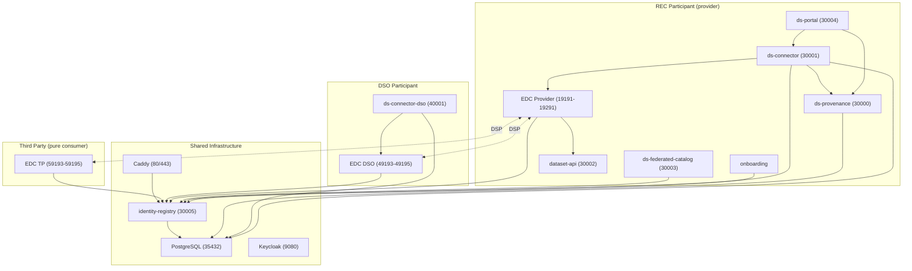
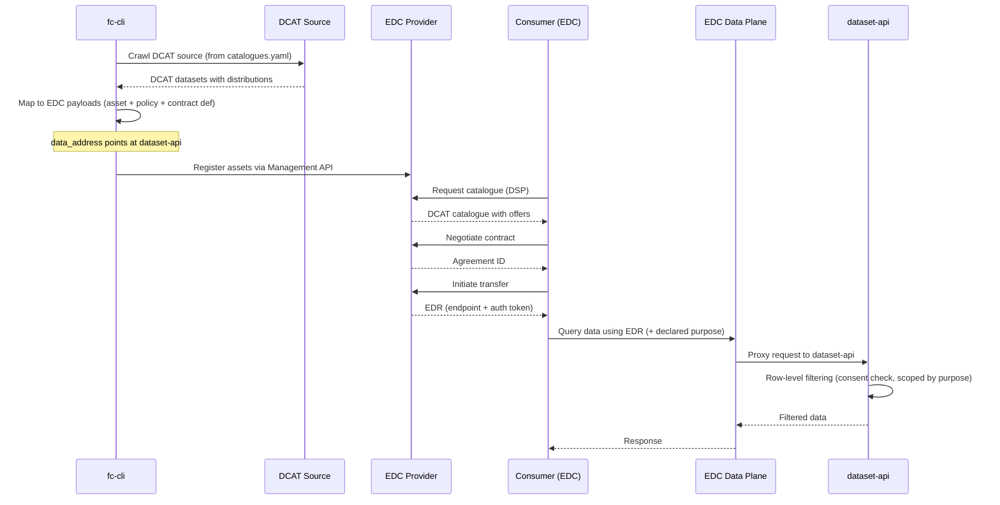

# Services Architecture

This document describes the overall architecture: how services are organized, how they communicate, and the deployment topology.

---

## Service map

The dataspace uses a multi-participant topology. Shared infrastructure services (PostgreSQL, Caddy, Keycloak, identity-registry) run once and serve all participants. Each participant runs its own EDC connector. Application services (portal, provenance, federated catalog) are scoped to the participant's role. Participants can hold multiple roles (e.g. both provider and consumer) — each role is represented by a separate MembershipCredential VC and a separate connector instance sharing the same participant DID.



### Service interaction map

```
Portal (30004) --> ds-connector (30001) --> EDC Provider/Consumer
                                        --> ds-provenance (30000)
                                        --> Federated Catalog (30003)

EDC Provider <--DSP--> EDC Consumer
  |-->  identity-registry (30005)      STS token signing (/sts/{did}/token)
  |-->  identity-registry (30005)      VP queries (/credentials/{did}/presentations/query)
  |-->  ds-connector /internal/*       ODRL constraint evaluation

identity-registry (30005)
  |-->  Caddy (DID resolution proxy)
  |-->  ds-connector (participant registry)
  |-->  federated-catalog (provider discovery)

dataset-api (30002, external) --> ds-connector /internal/*  agreement + purpose-scoped consent checks
```

### Shared infrastructure (root docker-compose.yml)

| Service | Image | Port | Purpose |
|---------|-------|------|---------|
| Caddy | `caddy:2-alpine` | 80, 443 | Reverse proxy, TLS termination, DID resolution proxy (`*.dataspaces.localhost` to identity-registry) |
| PostgreSQL | `postgres:17.4-alpine` | 35432 | Shared database (one DB per service) |
| Keycloak | Keycloak | 9080 | OIDC provider for user authentication |
| identity-registry | `ds-identity-registry` | 30005 | DID documents, STS token signing, credential presentations, participant registry, StatusList2021 |

### Application services

| Service | Port | Stack | Purpose |
|---------|------|-------|---------|
| ds-connector | 30001 | FastAPI | EDC orchestration, consent, participant registry (HttpParticipantRegistry backed by identity-registry) |
| ds-provenance | 30000 | FastAPI | PROV-O lineage and audit trail |
| ds-federated-catalog | 30003 | FastAPI | DCAT catalogue aggregation, queries identity-registry for participant discovery |
| ds-portal | 30004 | SvelteKit | Web frontend for all participant roles |
| dataset-api | 30002 | FastAPI | Data access layer with row-level filtering |
| onboarding | -- | -- | User onboarding and credential issuance |
| ds-connector-dso | 40001 | FastAPI | DSO-specific connector (authorization queries) |

---

## Communication patterns

### Synchronous HTTP

All inter-service communication uses HTTP REST:

| Caller | Callee | Protocol | Purpose |
|--------|--------|----------|---------|
| Portal | ds-connector | HTTP (SSR) | All data operations |
| Portal | ds-provenance | HTTP (SSR) | Lineage, audit queries |
| ds-connector | EDC Provider/Consumer | EDC Management API v3 | Asset/policy CRUD, negotiation, transfer |
| ds-connector | identity-registry | HTTP | Participant registry, scope checks |
| ds-connector | ds-provenance | HTTP | Emit provenance events |
| onboarding | identity-registry | HTTP | Credential issuance, Keycloak sync |
| EDC | identity-registry | OAuth2 client_credentials | STS token signing (`POST /sts/{did}/token`) |
| EDC | identity-registry | DCP Credential Service API | VP queries (`POST /credentials/{did}/presentations/query`) |
| EDC | ds-connector | HTTP | Internal constraint checks (`/internal/*`) |
| EDC Provider <-> EDC Consumer/DSO/TP | DSP | Contract negotiation, transfer |
| dataset-api | ds-connector | HTTP | Agreement validation, consent check |
| Federated catalog | identity-registry | HTTP | Participant discovery |
| Caddy | identity-registry | HTTP reverse proxy | DID document resolution (`*.dataspaces.localhost`) |

### No message queues

The architecture is fully synchronous. There are no message brokers, event buses, or async messaging systems. Provenance events are emitted via HTTP POST (fire-and-forget with retry via `tenacity`).

---

## Network topology

All services share a single Docker bridge network named `dataspaces`. Internal service-to-service calls use container hostnames (e.g. `edc-provider:19194`). External access goes through Caddy's HTTPS reverse proxy.

```
Internet / Browser
       |
       v
    Caddy (443)
       |
       |---> 172.17.0.1:30004  (portal)
       |---> 172.17.0.1:30001  (connector)
       |---> 172.17.0.1:30005  (identity-registry)
       |---> 172.17.0.1:30000  (provenance)
       |---> 172.17.0.1:30003  (federated-catalog)
       |---> edc-provider:19194          (DSP protocol)
       |---> edc-dso:49194               (DSP protocol)
       |---> edc-tp:59194                (DSP protocol)
       +---> 172.17.0.1:9080   (keycloak)
```

Caddy also proxies DID resolution requests: requests to `*.dataspaces.localhost` are forwarded to the identity-registry, which serves DID documents dynamically from its database.

Services running locally (outside Docker) use `172.17.0.1` to reach containers. Services running inside Docker use container names directly.

> **Overlay deployments** (e.g. demo3) create their own `dataspace` bridge network via their own `docker-compose.yml` rather than joining the `dataspaces` external network defined in this repo. This keeps the overlay self-contained and avoids port conflicts with the base platform network.

---

## Database layout

A single PostgreSQL instance hosts multiple databases:

| Database | Owner | Tables |
|----------|-------|--------|
| `connector` | ds-connector | consent_records, transfer_tracking |
| `connector_dso` | ds-connector-dso | consent_records, transfer_tracking (DSO instance) |
| `identity_registry` | identity-registry | participants, credentials, sync_state |
| `provenance` | ds-provenance | prov_nodes, prov_relations, domain_events |

Each service manages its own schema via Alembic migrations. There are no cross-database queries.

---

## Auth and identity layers

### User authentication (Portal)

```
Browser -> Portal -> Keycloak (OIDC)
```

Auth.js handles the OIDC flow. Keycloak issues JWTs with roles (`admin`, `dataset.admin`) and scopes (`dataspaces.query`). The portal derives a `UserPersona` to gate UI sections.

### Machine authentication (EDC <-> EDC)

```
EDC -> identity-registry (SI token)  -> EDC
EDC -> identity-registry (VP)        -> EDC
```

During DSP negotiation, each EDC instance obtains an SI token and a VP from the identity-registry. The identity-registry signs SI tokens using the participant's database-stored private key and builds VPs from database-stored VCs. The counterparty verifies both against the sender's DID document (also served by the identity-registry via Caddy). Private keys never leave the identity-registry process.

### Identity-registry admin authentication

The identity-registry's `/admin/*` endpoints require a JWT with the `identity-registry.admin` scope. This is typically issued by Keycloak to service accounts (e.g. `svc-onboarding`) that need to manage participant records, issue credentials, or trigger Keycloak sync.

### Internal API authentication

ds-connector's `/internal/*` endpoints are called by EDC extensions and dataset-api. In the current dev setup these are unauthenticated (network-level trust). In production, secure with API keys or mTLS.

---

## Port scheme

| Range | Purpose | Examples |
|-------|---------|---------|
| 30000-30009 | Python/Node services | provenance:30000, connector:30001, dataset-api:30002, catalog:30003, portal:30004, identity-registry:30005 |
| 30900-30909 | Debug ports | provenance:30900, connector:30901 |
| 19191-19291 | EDC provider (REC) | mgmt:19191, DSP:19194, data:19291 |
| 29191-29291 | EDC consumer (REC) | mgmt:29191, DSP:29194, data:29291 |
| 40001 | DSO connector | ds-connector-dso:40001 |
| 49193-49195 | EDC DSO | mgmt:49193, DSP:49194, public:49195 |
| 59193-59195 | EDC Third Party | mgmt:59193, DSP:59194, public:59195 |
| 35432 | PostgreSQL | shared instance |
| 9080 | Keycloak | auth server |

---

## EDR data flow (catalogue to data access)

The federated catalog CLI (`fc-cli`) bridges DCAT catalogue sources with EDC asset registration. The full flow from catalogue crawl to data access:



Key points:

- `catalogues.yaml` defines DCAT sources with a `data_address` field pointing at dataset-api
- `fc-cli` crawls each source, maps distributions to EDC `HttpData` assets
- The `data_address` becomes the EDC asset's backend URL -- the data plane proxies consumer requests to it
- Row-level filtering happens at dataset-api, which calls `GET /internal/consent/check` on ds-connector
- The query carries the **purpose** it is made for, and the check returns only subjects whose consent covers it — so the same consumer, agreement and transfer return different rows depending on why they are asking

---

## Deployment modes

### Local development (full Docker)

```bash
task start    # shared infra + all service stacks
```

All services run in containers on the `dataspaces` network.

### Local development (hybrid)

```bash
docker compose up -d          # shared infra
task services:start           # all service stacks
# Stop the service you want to develop locally:
docker compose -f services/connector/docker-compose.yml stop ds-connector
cd services/connector && task run
```

The local process connects to PostgreSQL via `172.17.0.1:35432` and to other services via their container ports.

### Production

Each service has a `Dockerfile` and optional `charts/` directory for Helm deployment. The architecture assumes:
- External PostgreSQL (managed service)
- External Keycloak (or compatible OIDC provider)
- External secret management (replace dev key files)
- Ingress controller (replace Caddy)

---

## DSSC Blueprint building block coverage

| BB | Name | Service(s) |
|----|------|-----------|
| BB01 | Trust Framework | Trust anchor DID + VC issuance via identity-registry (`ir-cli bootstrap`) |
| BB02 | Identity & Attestation | identity-registry (DID lifecycle, key management, VC issuance, STS token signing, credential presentations), Caddy (DID resolution proxy) |
| BB03 | Access & Usage Policies | Governance lib, edc-extensions |
| BB04 | Data Offerings & Descriptions | Federated catalog, governance.yaml |
| BB05 | Publication & Discovery | EDC DSP, federated catalog |
| BB06 | Data Exchange | EDC connector, ds-connector |
| BB07 | Provenance & Traceability | ds-provenance |
| BB08 | Vocabulary Hub | Profile-namespaced ODRL vocabulary and SKOS purpose taxonomy (`GET /ns/policy`), sharing offers (`GET /ns/sharing-offers`) |
| BB09 | Data Sovereignty | Consent system in ds-connector — purpose-scoped, controller-bound |
| DCP | Dataspace Credential Protocol | EDC connectors + identity-registry (STS + credential service) |
