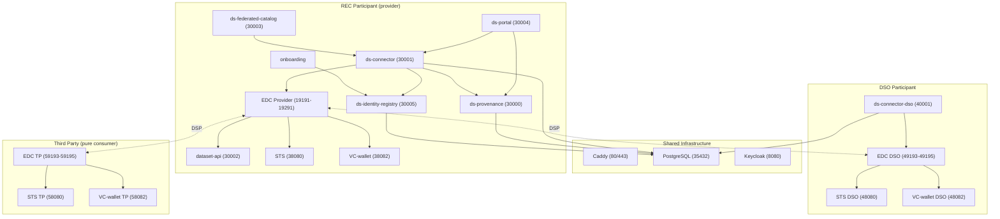
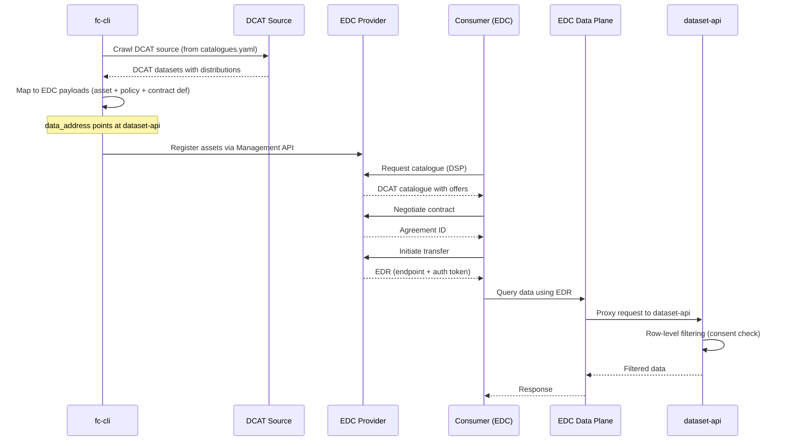

# Services Architecture

This document describes the overall architecture: how services are organized, how they communicate, and the deployment topology.

---

## Service map

The dataspace uses a three-participant topology. Each participant runs its own EDC + STS + VC-wallet stack, while application services are scoped to the participant's role.



### Shared infrastructure (root docker-compose.yml)

| Service | Image | Port | Purpose |
|---------|-------|------|---------|
| Caddy | `caddy:2-alpine` | 80, 443 | Reverse proxy, TLS termination, DID doc hosting |
| PostgreSQL | `postgres:17.4-alpine` | 35432 | Shared database (one DB per service) |

### Application services

| Service | Port | Stack | Purpose |
|---------|------|-------|---------|
| ds-connector | 30001 | FastAPI | EDC orchestration, consent, participant registry |
| ds-identity-registry | 30005 | FastAPI | Participant identity, DID, and credential management |
| ds-provenance | 30000 | FastAPI | PROV-O lineage and audit trail |
| ds-federated-catalog | 30003 | FastAPI | DCAT catalogue aggregation |
| ds-portal | 30004 | SvelteKit | Web frontend for all participant roles |
| dataset-api | 30002 | FastAPI | Data access layer with row-level filtering |
| onboarding | — | — | User onboarding and credential issuance |
| ds-connector-dso | 40001 | FastAPI | DSO-specific connector (authorization queries) |

---

## Communication patterns

### Synchronous HTTP

All inter-service communication uses HTTP REST:

| Caller | Callee | Protocol | Purpose |
|--------|--------|----------|---------|
| Portal | ds-connector | HTTP (SSR) | All data operations |
| Portal | ds-provenance | HTTP (SSR) | Lineage, audit queries |
| ds-connector | EDC Provider/Consumer | EDC Management API v3 | Asset/policy CRUD, negotiation, transfer |
| ds-connector | ds-identity-registry | HTTP | Participant registry, scope checks |
| ds-connector | ds-provenance | HTTP | Emit provenance events |
| onboarding | ds-identity-registry | HTTP | Credential issuance, Keycloak sync |
| EDC | STS | OAuth2 client_credentials | SI token issuance |
| EDC | VC-wallet | DCP Credential Service API | VP queries |
| EDC | ds-connector | HTTP | Internal constraint checks |
| EDC Provider ↔ EDC Consumer/DSO/TP | DSP | Contract negotiation, transfer |
| dataset-api | ds-connector | HTTP | Agreement validation, consent check |
| Federated catalog | ds-connector | HTTP | Catalog proxy, participant registry |

### No message queues

The architecture is fully synchronous. There are no message brokers, event buses, or async messaging systems. Provenance events are emitted via HTTP POST (fire-and-forget with retry via `tenacity`).

---

## Network topology

All services share a single Docker bridge network named `dataspaces`. Internal service-to-service calls use container hostnames (e.g. `edc-provider:19194`). External access goes through Caddy's HTTPS reverse proxy.

```
Internet / Browser
       |
       v
    Caddy (443)
       |
       |---> host.docker.internal:30004  (portal)
       |---> host.docker.internal:30001  (connector)
       |---> host.docker.internal:30005  (identity-registry)
       |---> host.docker.internal:30000  (provenance)
       |---> host.docker.internal:30003  (federated-catalog)
       |---> edc-provider:19194          (DSP protocol)
       |---> edc-dso:49194               (DSP protocol)
       |---> edc-tp:59194                (DSP protocol)
       +---> host.docker.internal:8080   (keycloak)
```

Services running locally (outside Docker) use `host.docker.internal` to reach containers. Services running inside Docker use container names directly.

> **Overlay deployments** (e.g. demo3) create their own `dataspace` bridge network via their own `docker-compose.yml` rather than joining the `dataspaces` external network defined in this repo. This keeps the overlay self-contained and avoids port conflicts with the base platform network.

---

## Database layout

A single PostgreSQL instance hosts multiple databases:

| Database | Owner | Tables |
|----------|-------|--------|
| `connector` | ds-connector | consent_records, transfer_tracking |
| `connector_dso` | ds-connector-dso | consent_records, transfer_tracking (DSO instance) |
| `identity_registry` | ds-identity-registry | participants, credentials, sync_state |
| `provenance` | ds-provenance | prov_nodes, prov_relations, domain_events |

Each service manages its own schema via Alembic migrations. There are no cross-database queries.

---

## Auth and identity layers

### User authentication (Portal)

```
Browser → Portal → Keycloak (OIDC)
```

Auth.js handles the OIDC flow. Keycloak issues JWTs with roles (`admin`, `dataset.admin`) and scopes (`dataspaces.query`). The portal derives a `UserPersona` to gate UI sections.

### Machine authentication (EDC ↔ EDC)

```
EDC → STS (SI token) → EDC
EDC → VC-wallet (VP) → EDC
```

During DSP negotiation, each EDC instance obtains an SI token from its STS and a VP from its VC wallet. The counterparty verifies both against the sender's DID document. The identity-registry is the source of participant keys and verifiable credentials used in this flow.

### Identity-registry admin authentication

The identity-registry's `/admin/*` endpoints require a JWT with the `identity-registry.admin` scope. This is typically issued by Keycloak to service accounts (e.g. `svc-onboarding`) that need to manage participant records, issue credentials, or trigger Keycloak sync.

### Internal API authentication

ds-connector's `/internal/*` endpoints are called by EDC extensions and dataset-api. In the current dev setup these are unauthenticated (network-level trust). In production, secure with API keys or mTLS.

---

## Port scheme

| Range | Purpose | Examples |
|-------|---------|---------|
| 30000-30009 | Python/Node services | provenance:30000, connector:30001, dataset-api:30002, catalog:30003, portal:30004, identity-registry:30005 |
| 30900-30909 | Debug ports | provenance:30900, connector:30901 |
| 19191-19291 | EDC provider (REC) | mgmt:19191, DSP:19194, data:19291 |
| 29191-29291 | EDC consumer (REC) | mgmt:29191, DSP:29194, data:29291 |
| 38080-38083 | DCP services (REC) | STS:38080-38081, wallet:38082-38083 |
| 40001 | DSO connector | ds-connector-dso:40001 |
| 49193-49195 | EDC DSO | mgmt:49193, DSP:49194, public:49195 |
| 48080, 48082 | DCP services (DSO) | STS:48080, wallet:48082 |
| 59193-59195 | EDC Third Party | mgmt:59193, DSP:59194, public:59195 |
| 58080, 58082 | DCP services (TP) | STS:58080, wallet:58082 |
| 35432 | PostgreSQL | shared instance |
| 8080 | Keycloak | auth server |

---

## EDR data flow (catalogue to data access)

The federated catalog CLI (`fc-cli`) bridges DCAT catalogue sources with EDC asset registration. The full flow from catalogue crawl to data access:



Key points:

- `catalogues.yaml` defines DCAT sources with a `data_address` field pointing at dataset-api
- `fc-cli` crawls each source, maps distributions to EDC `HttpData` assets
- The `data_address` becomes the EDC asset's backend URL -- the data plane proxies consumer requests to it
- Row-level filtering happens at dataset-api, which calls `GET /internal/consent/check` on ds-connector

---

## Deployment modes

### Local development (full Docker)

```bash
task start    # shared infra + all service stacks
```

All services run in containers on the `dataspaces` network.

### Local development (hybrid)

```bash
docker compose up -d          # shared infra
task services:start           # all service stacks
# Stop the service you want to develop locally:
docker compose -f services/connector/docker-compose.yml stop ds-connector
cd services/connector && task run
```

The local process connects to PostgreSQL via `host.docker.internal:35432` and to other services via their container ports.

### Production

Each service has a `Dockerfile` and optional `charts/` directory for Helm deployment. The architecture assumes:
- External PostgreSQL (managed service)
- External Keycloak (or compatible OIDC provider)
- External secret management (replace dev key files)
- Ingress controller (replace Caddy)

---

## DSSC Blueprint building block coverage

| BB | Name | Service(s) |
|----|------|-----------|
| BB01 | Trust Framework | Trust anchor DID + VC issuance (scripts/) |
| BB02 | Identity & Attestation | STS, VC-wallet, Caddy (DID docs), ds-identity-registry |
| BB03 | Access & Usage Policies | Governance lib, edc-extensions |
| BB04 | Data Offerings & Descriptions | Federated catalog, governance.yaml |
| BB05 | Publication & Discovery | EDC DSP, federated catalog |
| BB06 | Data Exchange | EDC connector, ds-connector |
| BB07 | Provenance & Traceability | ds-provenance |
| BB08 | Vocabulary Hub | ds: namespace (connector /ns/energy) |
| BB09 | Data Sovereignty | Consent system in ds-connector |
| DCP | Dataspace Credential Protocol | EDC + STS + VC-wallet |
