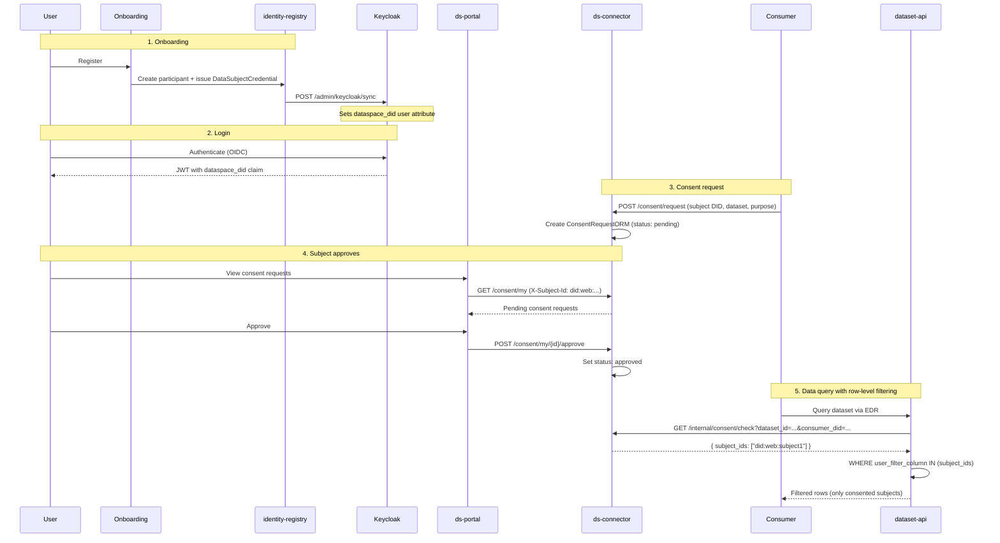

# Consent & Data Sovereignty

This document describes the consent management system: how data subjects grant and revoke consent, how consent gates data access at query time, and how revocation terminates active transfers.

---

## Overview

The dataspace supports per-subject, per-dataset consent for datasets classified as PII or configured with row-level filtering. The consent system works across multi-participant dataspaces, including DSO (Data Space Operator) participants who can query authorization state without being party to the consent exchange.

The consent lifecycle is:

1. A consent request is created (by the provider or automatically)
2. The data subject approves or rejects via the consent portal
3. If approved, the consumer can access rows belonging to that subject
4. The data subject can revoke at any time, which terminates linked transfers

---

## Consent model

### Database schema

The consent system uses PostgreSQL via async SQLAlchemy. Key tables in `services/connector/src/connector/db/models.py`:

**ConsentRequestORM**

| Field | Type | Purpose |
|-------|------|---------|
| `id` | UUID | Primary key |
| `subject_id` | TEXT | Data subject identifier (e.g. email, user ID) |
| `dataset_id` | TEXT | Asset ID of the dataset |
| `consumer_did` | TEXT | DID of the requesting consumer |
| `status` | TEXT | `pending`, `approved`, `rejected`, `revoked` |
| `purpose` | TEXT | Stated purpose for data access |
| `created_at` | TIMESTAMP | When the request was created |
| `updated_at` | TIMESTAMP | Last status change |

**ConsumerTransferORM**

| Field | Type | Purpose |
|-------|------|---------|
| `id` | UUID | Primary key |
| `consent_id` | UUID | FK to ConsentRequestORM |
| `transfer_process_id` | TEXT | EDC transfer process ID |
| `agreement_id` | TEXT | EDC contract agreement ID |
| `active` | BOOLEAN | Whether the transfer is still running |

---

## Consent API

All consent endpoints are on ds-connector under `/consent/`:

### For data subjects

| Endpoint | Purpose |
|----------|---------|
| `GET /consent/my` | List my consent requests (filtered by authenticated subject) |
| `POST /consent/my/{id}/approve` | Approve a pending consent request |
| `POST /consent/my/{id}/reject` | Reject a pending consent request |
| `POST /consent/my/{id}/revoke` | Revoke a previously approved consent |

### For consumers/providers

| Endpoint | Purpose |
|----------|---------|
| `POST /consent/request` | Create a new consent request for a subject |

### Internal (called by EDC extensions and dataset-api)

| Endpoint | Purpose |
|----------|---------|
| `GET /internal/consent/check` | Check if active consent exists; returns consented subject IDs |
| `POST /consent/register-transfer` | Link a transfer process to a consent record |

---

## Consent enforcement flow

### At negotiation time (ODRL constraint)

When a dataset has `user_filter_column` set in `governance.yaml`, the `GovernanceMapper` adds a profile-namespaced `ConsentStatus eq "active"` constraint (e.g. `dsp-policy:ConsentStatus`) to the ODRL offer.

During EDC negotiation, `ConsentStatusFunction` in `edc-extensions` calls `GET /internal/consent/check` to verify that at least one active consent record exists for the requesting participant.

### At query time (row-level filtering)

When the consumer queries data via the dataset API:

1. dataset-api calls `GET /internal/consent/check?consumer_did=...&dataset_id=...`
2. ds-connector returns the list of `subject_id` values with `status: approved`
3. dataset-api adds `WHERE {user_filter_column} IN (subject_ids)` to the SQL query
4. Only rows belonging to consenting subjects are returned

This implements **attribute-based access control** at the row level — the consumer sees different data depending on which subjects have consented.

---

## Revocation flow

When a data subject revokes consent:

```
Subject (Portal)          ds-connector              EDC Consumer
  │                            │                         │
  │  POST /consent/my/{id}/    │                         │
  │  revoke                    │                         │
  ├───────────────────────────→│                         │
  │                            │  1. Set status=revoked  │
  │                            │  2. Find linked transfers│
  │                            │  3. For each transfer:  │
  │                            │     POST /management/v3/│
  │                            │     transferprocesses/  │
  │                            │     {id}/terminate      │
  │                            ├────────────────────────→│
  │                            │                         │
  │  { status: "revoked" }     │                         │
  │←───────────────────────────┤                         │
```

After revocation:
- The consent record status is set to `revoked`
- All linked EDC transfer processes are terminated via the Management API
- Future `consent/check` calls exclude this subject from the allowed list
- The consumer can no longer access rows belonging to this subject

---

## Portal consent views

### Data subject view (`/consent`)

- Lists all consent requests for the authenticated subject
- Each entry shows: dataset name, requesting consumer, purpose, status, timestamps
- Actions: Approve, Reject (for pending), Revoke (for approved)
- `ConsentBadge.svelte` renders status with color coding

### Provider view

The provider governance dashboard shows consent statistics per dataset.

---

## Notifications

The consent service supports notifying data subjects when a consent request is created. Notification backends are configured via environment variables:

| Backend | Config | Behavior |
|---------|--------|----------|
| `null` (default) | — | No-op; consent requests appear in portal only |
| `smtp` | SMTP host/port/credentials | Sends email to the subject |
| `webhook` | Webhook URL | POSTs to an external endpoint |

The notification system is pluggable via the `Notifier` protocol in `services/connector/src/connector/notifications/base.py`.

---

## Authorizations query

`GET /provider/authorizations` provides a read-only view of which subjects have consented to which datasets. This endpoint is intended for DSO and compliance tooling.

### Behavior

- Aggregates consent records across all consumers
- Deduplicates by latest consent record per (dataset, subject) pair
- Returns only public identifiers: dataset IDs and subject DIDs
- Datasets with no consented subjects are excluded from the response

### Example response

```json
{
  "authorizations": [
    {
      "dataset_id": "energy-meters-v2",
      "subject_dids": [
        "did:web:subject1.dataspaces.localhost",
        "did:web:subject2.dataspaces.localhost"
      ]
    }
  ]
}
```

### Access

This endpoint is on the provider API group (`/provider/authorizations`). In the DSO topology, `ds-connector-dso` exposes this endpoint for the DSO participant to poll without participating in the consent exchange itself.

---

## Onboarding to consent flow

The full lifecycle from user onboarding through consent-gated data access:



Key points:

- Subject identity flows from identity-registry through Keycloak into JWTs as the `dataspace_did` claim
- The portal reads this claim to identify the subject on consent API calls
- Row-level filtering at dataset-api uses the same subject DID that was stored in the consent record
- See [consent-subject-id.md](../services/connector/docs/consent-subject-id.md) for detailed subject identity resolution

---

## Subject-pool binding (UC-1)

When a dataset has an `ownership` block in its governance rule, the consent endpoint validates that each subject is a member of the dataset owner's organization before creating a consent request.

The check flow:
1. `POST /consent/request` receives `dataset_id` and `subject_ids`
2. Connector resolves the governance rule for `dataset_id`, extracts `ownership[0].name`
3. For each subject, derives the subject DID and calls `GET /memberships/check?user_did=<did>&organization=<alias>` on the identity-registry
4. If any subject is not a member → 403 ("subject not a member of dataset owner organization")
5. Datasets without `ownership` skip the check (backward compatible)

This ensures that consent can only be granted for subjects who actually belong to the data-owning organization — preventing out-of-pool consent requests.

---

## DSSC Blueprint alignment

| Building Block | Implementation |
|---------------|---------------|
| BB09 (Data Sovereignty) | Per-subject consent with ABAC row filtering, subject-pool validation |
| BB03 (Access & Usage Policies) | Profile-namespaced `ConsentStatus` ODRL constraint in policy offers |
| BB06 (Data Exchange) | Revocation terminates active EDC transfer processes |
