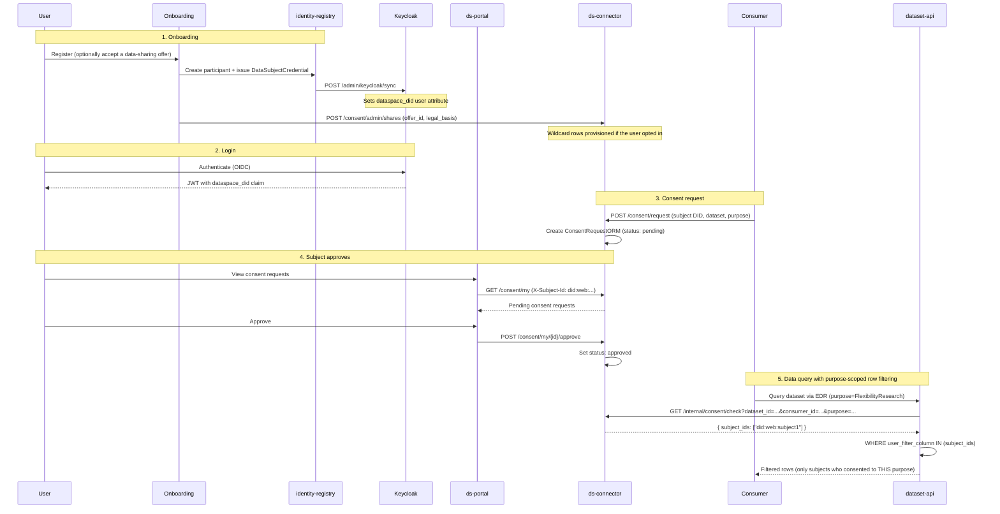

# Consent & Data Sovereignty

This document describes the consent management system: what a person is actually asked, how that question is bound to an enforceable vocabulary, how consent gates data access at negotiation and query time, and how revocation terminates active transfers.

---

## Overview

A person does not consent to a dataset. They consent to a **purpose-scoped bundle, from a named controller, for a described category of recipient**. That bundle is a *sharing offer*, and it is the unit the platform asks about, records, and enforces.

The dataspace supports per-subject consent for datasets classified as PII or configured with row-level filtering. The consent system works across multi-participant dataspaces, including DSO (Data Space Operator) participants who can query authorization state without being party to the consent exchange.

The consent lifecycle is:

1. A sharing offer is published (`GET /ns/sharing-offers`), or a consumer creates a consent request
2. The data subject grants or refuses, per offer, via the portal or the onboarding wizard
3. If granted, a consumer negotiating for a purpose that consent covers can access that subject's rows
4. The data subject can revoke at any time, which terminates linked transfers

---

## The purpose chain

Three vocabularies have to agree before a question can mean anything. The chain that links them is the core of the model:

```
 consent text (versioned, English + frontend i18n)
        │  declares
        ▼
 purpose slug ──────────────► ODRL profile taxonomy (/ns/policy, SKOS)
        │                              ▲     └── dpv_mapping → DPV IRI + relation
        │ groups                       │     └── broader → local hierarchy (enforcement)
        ▼                              │ validated against
 sharing offer ──── resolves to ──► governance.yaml datasets
   ├── purpose                         │ declare policy.purpose[]
   ├── recipients{controller,          ▼
   │              processors,  ODRL offer constraint
   │              admitted_by}         │
   └── legal_basis                     │
        │ consented as                 │
        ▼                              │
 consent row (dataset_id + purpose + controller-role, all validated)
        │                              │
        └────── compared at ───────────┘
              /internal/consent/check
```

Every link is checked. `task compliance:validate` fails if an offer names a purpose outside the taxonomy, a dataset that does not resolve, a controller that is not in the owners registry, or a dataset that does not declare the offer's purpose in `policy.purpose[]`.

### Purposes are declared, not inferred from tags

`tags` are DCAT-AP catalogue keywords — a *topic*. A purpose is a *reason for processing*. One meter dataset can serve incentive calculation, flexibility research, or cost optimisation, so deriving a purpose from a tag is a category error.

**`policy.purpose[]` is the only runtime source of a dataset's purposes.** The profile's `tag_to_purpose` map survives only as an authoring default when scaffolding a new governance entry (`GovernanceMapper.derive_purposes_from_tags`), never as runtime truth.

### The taxonomy is SKOS, aligned to DPV

The purpose taxonomy lives in the ODRL profile (`libs/governance/src/ds/governance/profiles/energy.yaml`) and is served at `GET /ns/policy` as `skos:Concept` entries:

```yaml
purposes:
  - slug: FlexibilityResearch
    label: Flexibility research
    definition: Studying when and how much consumption can shift.
    broader: EnergyCommunityOperation
    dpv_mapping:
      iri: "https://w3id.org/dpv#ResearchAndDevelopment"
      relation: broadMatch
```

Two fields, two very different jobs:

| Field | Served as | Used for |
|---|---|---|
| `broader` | `skos:broader` | **Enforcement.** The local hierarchy `odrl:isA` matching walks. |
| `dpv_mapping` | `skos:broadMatch` (or another SKOS match property) | **Interop and documentation only.** Never matched against. |

> **Safety rule.** `odrl:isA` matching follows **only** the local `broader` chain. The DPV alignment is deliberately not consulted: our purposes are domain specialisations of DPV's generic terms, so `FlexibilityResearch broadMatch dpv:ResearchAndDevelopment` would otherwise let a consumer whose policy says `dpv:ResearchAndDevelopment` match a member's flexibility consent — covering research unrelated to flexibility. That silently widens consent.
>
> An absent mapping is honest. A wrong one is a false interop claim that fails silently, which is why `relation` must be one of the five SKOS match properties and the CI gate rejects anything else.

---

## Sharing offers

Offers live in `services/connector/governance/sharing-offers.yaml`, with the same overlay mechanism as `governance.yaml` (`sharing-offers.<name>.yaml`; `*.local.yaml` is gitignored).

```yaml
sharing_offers:
  - id: household-energy-flexibility
    purpose: FlexibilityResearch
    legal_basis: "https://w3id.org/dpv#Consent"
    datasets: [datasets.silver.meters_15m]
    recipients:
      controller: example-org            # who decides the purpose
      processors:
        category: appointed-service-providers
        admitted_by:                     # ODRL-checkable, not a promise
          - membership: example-org
          - credential_type: OrganizationCredential
    subject_scope: own_data
    measures: [consumption]
    resolution: PT15M
    coverage: { retrospective: P1Y, prospective: P2Y }
    consent_text_version: "1.0"
    revocable: true
    retention: P2Y
```

### `legal_basis` is not decoration

Only `dpv:Consent` offers get a control in a frontend. Contract-based processing is **disclosed, not toggled**: asking for consent where contractual necessity applies implies a choice that does not exist, which EDPB guidance treats as invalidating. `POST /consent/my/shares` returns **409** for a non-consent-based offer, so a UI bug cannot manufacture a fake choice.

### Codes, not prose

`ds` serves **facts as codes** plus an **English label and definition for every code — English only**. Translation is entirely a frontend matter. Locale identifiers exchanged with frontends are BCP 47.

| Served by `ds` (codes + English) | Supplied by the frontend (i18n) |
|---|---|
| `purpose: FlexibilityResearch` | label + definition per locale |
| `measures: [consumption]` | labels per locale |
| `resolution: PT15M` | *"ogni 15 minuti"* / *"every 15 minutes"* |
| `coverage: {retrospective: P1Y, prospective: P2Y}` | *"l'anno passato e i prossimi 2 anni"* |
| `recipients.processors.category` | *"i fornitori incaricati dalla comunità"* |
| `consent_text_version: "1.0"` | the consent text body per locale |

A frontend cannot invent a resolution or widen a coverage window — it can only mistranslate a label, which is ordinary i18n QA. The English label is the fallback, so an untranslated code degrades to readable English, never a raw slug.

### `GET /ns/sharing-offers`

Public by design — a vocabulary, not data — mirroring `/ns/policy`. An onboarding wizard has to render offers before anyone has an identity.

```json
[{
  "id": "household-energy-flexibility",
  "purpose": "FlexibilityResearch",
  "purpose_broader": ["EnergyCommunityOperation"],
  "legal_basis": "https://w3id.org/dpv#Consent",
  "requires_consent": true,
  "recipients": {
    "controller": "example-org",
    "controller_role": null,
    "processors": { "category": "appointed-service-providers" }
  },
  "subject_scope": "own_data",
  "measures": ["consumption"],
  "resolution": "PT15M",
  "coverage": { "retrospective": "P1Y", "prospective": "P2Y" },
  "consent_text_version": "1.0",
  "revocable": true,
  "retention": "P2Y",
  "user_visible_hash": "…",
  "dataset_count": 1,
  "fallback_text_en": { "purpose_label": "Flexibility research", "…": "…" }
}]
```

**Dataset keys are not in the public projection.** Which datasets back an offer is operator detail the person was never shown.

---

## The circle — who is covered, who must be asked

The circle is the agreement record:

```
in_circle(participant) := has a current accepted agreement
                       AND satisfies offer.recipients.processors.admitted_by
```

Both halves are checkable at negotiation time. The wildcard therefore means "anyone the controller has a signed agreement with, for this purpose" — a category a person can understand and the platform can enforce — rather than "anyone governance admits".

The system cannot infer capacity; the agreement must declare it (`processor | joint_controller | independent_controller`).

| The requester is… | New consent? | Basis |
|---|---|---|
| **Processor** of the offer's controller (Art. 28 — acts on instructions, under a DPA, cannot use data for its own ends) | **No** — disclosed + notified | The controller has not changed; the processing operation is the same. Art. 13(1)(e) requires disclosing recipients, and disclosure ≠ consent |
| **Independent controller** — decides its own purposes | **Yes** | Consent under Art. 4(11) is consent to *a specific controller's* processing |
| **Joint controller** (Art. 26) | **Yes**, plus an Art. 26 arrangement | The person must know who they are dealing with |

`POST /consent/request` returns **409** when the requester is already covered as a processor of the offer's controller: that recipient must be disclosed, not asked. Asking anyway would train people to click through the questions that do matter.

> **Controller ≠ legal entity.** A DSO's grid-operations function and its metering function are different controllers under unbundling rules (Electricity Directive 2019/944) — same company, two capacities. `Participant.roles` is a list, so the consent key is **(subject, purpose, controller-role)**, not (subject, purpose, organisation).

Until the identity-registry carries agreements with a `capacity` field (organisation onboarding), capacity is not provable and every requester resolves to *outside the circle* — which asks rather than assumes. That is the safe direction: a redundant question is recoverable, a skipped one is not.

### Two facets, two entry points, one table

| Facet | Mechanism | Row starts as |
|---|---|---|
| Inside circle — standing availability | Sharing offers → `POST /consent/my/shares` with `offer_id` | `granted` |
| Outside circle — new request | `POST /consent/request` → `/consent/my/{id}/approve\|reject` | `pending` |

Both write the same `ConsentRequestORM`. The only differences are the controller identity and the starting status.

---

## Consent is asked once — material-change rules

> Never pester. Ask at onboarding, then manage at governance level. The system must never *block* a person because they have not consented to something new.

Consent binds to **the facts the person read**. `user_visible_hash` is a SHA-256 over `purpose` (+ its `broader` chain), `legal_basis`, `recipients.controller`, `recipients.processors.category`, `subject_scope`, `measures`, `resolution`, `coverage`, `retention` and `revocable`. **Explicitly not over `datasets[]`.**

| Change | Re-consent? | Why |
|---|---|---|
| Dataset added/removed/replaced, same user-visible facts | **No** | Schema migration, medallion re-layering, source swap |
| New **processor** joins the declared category | **No** — notify + disclose | Same controller, same operation |
| Purpose **narrowed** (`broader`-reachable from the consented one) | **No** | `odrl:isA` local match |
| Purpose widened or replaced by a sibling | **Yes**, delta only | New reason |
| `measures`, `resolution`, `coverage`, `retention` change | **Yes**, delta only | Contradicts what was read |
| `consent_text_version` bumped, facts unchanged | **No** — record silently | Editorial/translation fix |
| **New independent controller** | **Yes** — via a consent request | A different controller is a different operation |
| New offer published | **No prompt** | Passive in `/my-data`, never blocking |

Operational safeguards:

- **Onboarding is one-shot.** No re-consent flow is ever added to the wizard; post-approval management is portal + governance only.
- Re-consent is **per-offer and per-delta** — never "re-accept everything".
- Revocation is always available and immediate.
- A material change **suspends** affected rows (fail-closed for the delta) rather than revoking the whole offer.

The CI gate asserts `user_visible_hash` is stable across a no-op reload, precisely so a redeploy cannot trigger a re-consent storm.

---

## Consent model

### Database schema

The consent system uses PostgreSQL via async SQLAlchemy. Key tables in `services/connector/src/connector/db/models.py`:

**ConsentRequestORM**

| Field | Type | Purpose |
|-------|------|---------|
| `id` | UUID | Primary key |
| `subject_id` | TEXT | Data subject DID |
| `consumer_id` | TEXT | DID of the requesting consumer — or `*`, the **scoped wildcard** (see below) |
| `dataset_id` | TEXT | Governance key of the dataset — validated on write |
| `purpose` | JSON | Purpose slugs from the ODRL taxonomy — validated on write. Empty is never a wildcard |
| `controller` | TEXT | Owner alias of the controller that decides the purpose |
| `controller_role` | TEXT | Which role of that participant is acting |
| `offer_id` | TEXT | The sharing offer this row came from, when it came from one |
| `legal_basis` | JSON | Evidence of the basis this row was written under — DPV `basis_iri`, `consent_text_version`, `locale`, rendered-text SHA-256, `user_visible_hash`, `submission_ref`. **Codes and hashes only, never PII** |
| `status` | TEXT | `pending`, `granted`, `rejected`, `revoked` |
| `requested_at` / `decided_at` / `revoked_at` | TIMESTAMP | Lifecycle timestamps |
| `revocation_reason` | TEXT | Why it was revoked |
| `transfer_ids` | JSON | EDC transfer processes to terminate on revocation |

**ConsumerTransferORM**

| Field | Type | Purpose |
|-------|------|---------|
| `id` | UUID | Primary key |
| `transfer_id` | TEXT | EDC transfer process ID |
| `subject_id` | TEXT | Data subject the transfer is scoped to |
| `asset_id` | TEXT | Asset being transferred |
| `contract_agreement_id` | TEXT | EDC contract agreement ID |
| `consumer_id` | TEXT | Consumer participant DID |

---

## Consent API

Vocabulary endpoints are public; consent endpoints authenticate on `X-Subject-Id` + `X-User-VC` (**not** `require_permission` — see the security posture in the root `AGENTS.md`).

### Public vocabulary

| Endpoint | Purpose |
|----------|---------|
| `GET /ns/policy` | ODRL vocabulary + SKOS purpose taxonomy (`skos:broader`, DPV match properties) |
| `GET /ns/sharing-offers` | Sharing offers as codes + English fallbacks, without dataset keys |

### For data subjects

| Endpoint | Purpose |
|----------|---------|
| `GET /consent/my` | List my consent records |
| `GET /consent/my/shares` | List my standing sharing decisions |
| `POST /consent/my/shares` | Grant or revoke — by `offer_id` (preferred) or `dataset_id` |
| `POST /consent/my/{id}/approve` | Approve a pending consent request |
| `POST /consent/my/{id}/reject` | Reject a pending consent request |
| `POST /consent/my/{id}/revoke` | Revoke a previously granted consent |

`POST /consent/my/shares` with an `offer_id` is the preferred form: the connector expands the offer into per-dataset rows and stamps the purpose and controller from the offer, so the caller never names a dataset and the decision cannot drift from the copy the person read.

| Response | Condition |
|---|---|
| `422` | Unknown `dataset_id`, unknown `offer_id`, or a purpose outside the taxonomy |
| `409` | The offer is not consent-based — it is disclosed, not toggled |

### For consumers/providers

| Endpoint | Purpose |
|----------|---------|
| `POST /consent/request` | Create a consent request for a set of subjects. Carries `controller`, `controller_role` and `offer_id`. `409` when the requester is already covered as a processor |

### Service-provisioned shares (onboarding)

| Endpoint | Purpose |
|----------|---------|
| `POST /consent/admin/shares` | Record a subject's standing sharing decision from an `offer_id`. Guarded by `connector.consent.provision` (a **service** scope, not the subject's VC-JWT). `422` unknown offer, `409` non-consent offer, `403` subject not a member of the offer's controller org |

The onboarding wizard calls this after it syncs a newly-approved participant's DID. It names an `offer_id`, never a dataset, so it cannot drift from the copy the person read. The connector expands the offer into one **wildcard-scoped** row per dataset (`consumer_id = "*"`), stamping purpose, controller-role, `legal_basis` and `user_visible_hash` from the offer. Idempotent.

**The scoped wildcard.** A `consumer_id = "*"` row admits **any party inside the circle** for its controller and purpose — a processor of the declared controller, never a new controller and never a new purpose. A per-party row overrides it:

| specific `granted` > wildcard | allow (purpose + controller-role must still match) |
|---|---|
| specific `revoked`/`rejected` > wildcard | deny — an explicit opt-out always wins |
| no specific + wildcard `granted` | allow (purpose + controller-role must still match) |
| no specific + no wildcard | deny — fail-closed |

### Internal (called by EDC extensions and dataset-api)

| Endpoint | Purpose |
|----------|---------|
| `GET /internal/consent/check` | Purpose- and role-scoped consent check; returns consented subject IDs |
| `POST /consent/register-transfer` | Link a transfer process to a consent record |

```
GET /internal/consent/check
    ?dataset_id=…&consumer_id=…
    [&subject_id=…]          # omit for the row-filter subject list
    [&purpose=A,B]           # comma-separated slugs or IRIs
    [&controller_role=…]
```

---

## Consent enforcement

### The matrix

For a dataset with `classification: pii`, `policy.consent.required: true`, a `user_filter_column`, or row filters:

| Consent row | Result |
|---|---|
| Requested purpose is the consented one or **narrower**, and controller-role matches | **allow** |
| Requested purpose is empty, unrelated, or **broader** | **deny** |
| Controller-role differs and the requester is not a covered processor | **deny** |
| Row purpose is empty | **deny** |
| Open / non-PII dataset | Consent check not applicable; the ODRL offer purpose still governs the consumer |

> **Empty `purpose[]` is never "unrestricted" for personal data.** For a consent-required dataset, an absent purpose means the person was never told the use, so the consent does not meet Art. 4(11). Fail closed. For open datasets there is no data subject and the question does not arise.
>
> The same rule applies to the *caller*: a request that declares no purpose against a consent-required dataset receives **zero rows**, not all of them. A PEP that predates the purpose chain therefore fails closed rather than silently receiving everything.

An unknown `dataset_id` reaching the check is also treated as consent-required, so a mis-keyed request denies rather than leaks.

### At negotiation time (ODRL constraint)

`GovernanceMapper` emits **one** `odrl:purpose` constraint per permission, listing every purpose the dataset declares:

- exactly one purpose → `odrl:isA` with that IRI
- several → `odrl:isAnyOf` with the list

One constraint, not one per purpose: constraints inside a permission are ANDed, so emitting several would demand a consumer's use serve all of them at once.

At negotiation, `PurposeFunction` admits the constraint shape, and `ConsentStatusFunction` reads the offered purposes **off the permission being evaluated** and passes them to `GET /internal/consent/check`. A negotiation for a dataset whose purposes no subject has consented to finds an empty subject pool and is denied.

Both `odrl:purpose` and its expanded form `http://www.w3.org/ns/odrl/2/purpose` are bound in `DataspacesExtension`; an unbound operand evaluates to false and would deny every negotiation for a purpose-scoped dataset.

### At query time (row-level filtering)

1. The consumer's query carries `purpose=<slug>` — the reason this query is made
2. dataset-api calls `GET /internal/consent/check?dataset_id=…&consumer_id=…&purpose=…`
3. ds-connector returns only the subjects whose consent covers that purpose (and controller-role)
4. dataset-api adds `WHERE {user_filter_column} IN (subject_ids)`

This is **attribute-based access control at the row level, scoped by purpose**: the same consumer, the same agreement and the same active transfer return different rows depending on *why* they are asking. A subject who consented to flexibility research contributes no rows to an incentive-calculation query.

---

## Revocation flow

When a data subject revokes consent:

```
Subject (Portal)          ds-connector              EDC Consumer
  │                            │                         │
  │  POST /consent/my/{id}/    │                         │
  │  revoke                    │                         │
  ├───────────────────────────→│                         │
  │                            │  1. Set status=revoked  │
  │                            │  2. Find linked transfers│
  │                            │  3. For each transfer:  │
  │                            │     POST /management/v3/│
  │                            │     transferprocesses/  │
  │                            │     {id}/terminate      │
  │                            ├────────────────────────→│
  │                            │                         │
  │  { status: "revoked" }     │                         │
  │←───────────────────────────┤                         │
```

After revocation:
- The consent record status is set to `revoked`
- All linked EDC transfer processes are terminated via the Management API
- Future `consent/check` calls exclude this subject from the allowed list
- The consumer can no longer access rows belonging to this subject

---

## Portal consent views

### Data subject view (`/consent`)

- Lists all consent requests for the authenticated subject
- Each entry shows: dataset name, requesting consumer, purpose, status, timestamps
- Actions: Approve, Reject (for pending), Revoke (for approved)
- `ConsentBadge.svelte` renders status with color coding

### Provider view

The provider governance dashboard shows consent statistics per dataset.

---

## Notifications

The consent service supports notifying data subjects when a consent request is created. Notification backends are configured via environment variables:

| Backend | Config | Behavior |
|---------|--------|----------|
| `null` (default) | — | No-op; consent requests appear in portal only |
| `smtp` | SMTP host/port/credentials | Sends email to the subject |
| `webhook` | Webhook URL | POSTs to an external endpoint |

The notification system is pluggable via the `Notifier` protocol in `services/connector/src/connector/notifications/base.py`.

---

## Authorizations query

`GET /provider/authorizations` provides a read-only view of which subjects have consented to which datasets. This endpoint is intended for DSO and compliance tooling.

### Behavior

- Aggregates consent records across all consumers
- Deduplicates by latest consent record per (dataset, subject) pair
- Returns only public identifiers: dataset IDs and subject DIDs
- Datasets with no consented subjects are excluded from the response

### Example response

```json
{
  "authorizations": [
    {
      "dataset_id": "energy-meters-v2",
      "subject_dids": [
        "did:web:subject1.dataspaces.localhost",
        "did:web:subject2.dataspaces.localhost"
      ]
    }
  ]
}
```

### Access

This endpoint is on the provider API group (`/provider/authorizations`). In the DSO topology, `ds-connector-dso` exposes this endpoint for the DSO participant to poll without participating in the consent exchange itself.

---

## Onboarding to consent flow

The full lifecycle from user onboarding through consent-gated data access:



Key points:

- Subject identity flows from identity-registry through Keycloak into JWTs as the `dataspace_did` claim
- The portal reads this claim to identify the subject on consent API calls
- Row-level filtering at dataset-api uses the same subject DID that was stored in the consent record
- The purpose is carried on the query and compared against each subject's consent, so the row set depends on *why* the data is being asked for
- See [consent-subject-id.md](../services/connector/docs/consent-subject-id.md) for detailed subject identity resolution

---

## Subject-pool binding (UC-1)

When a dataset has an `ownership` block in its governance rule, the consent endpoint validates that each subject is a member of the dataset owner's organization before creating a consent request.

The check flow:
1. `POST /consent/request` receives `dataset_id` and `subject_ids`
2. Connector resolves the governance rule for `dataset_id`, extracts `ownership[0].name`
3. For each subject, derives the subject DID and calls `GET /memberships/check?user_did=<did>&organization=<alias>` on the identity-registry
4. If any subject is not a member → 403 ("subject not a member of dataset owner organization")
5. Datasets without `ownership` skip the check (backward compatible)

This ensures that consent can only be granted for subjects who actually belong to the data-owning organization — preventing out-of-pool consent requests.

---

## Validation gate

`task compliance:validate` runs the consent-vocabulary checks alongside the governance ones. It picks up `sharing-offers.yaml` next to the governance file by convention, or takes `--sharing-offers <path>`.

| Check | Fails when |
|---|---|
| `purpose-hierarchy` | `broader` does not resolve, or the hierarchy contains a cycle |
| `purpose-mapping` | `dpv_mapping.iri` is not absolute, or `relation` is not a SKOS match property |
| `purpose-labels` | A purpose has no English label (a definition is a warning) |
| `purpose-declared` | A `policy.purpose[]` entry is not in the taxonomy |
| `offer-purpose` | An offer's purpose is not in the taxonomy, or an id is duplicated |
| `offer-datasets` | An offer references a key that is not an exposed dataset |
| `offer-consent-required` | An offer reaches a PII dataset that does not set `policy.consent.required` |
| `offer-dataset-purpose` | A dataset does not declare the offer's purpose in `policy.purpose[]` |
| `offer-controller` | The controller does not resolve, or `controller_role` is not one of that participant's roles |
| `offer-legal-basis` | `legal_basis` is not a recognised DPV legal-basis IRI |
| `offer-durations` | `resolution`, `retention` or a coverage bound is not an ISO 8601 duration |
| `offer-codes` | A code has no English fallback, or `subject_scope` is unknown |
| `offer-hash-stability` | `user_visible_hash` is not stable across recomputation |

---

## End-to-end verification

| Flow | Covers |
|---|---|
| `ds-e2e run -f smoke` | Full DSP consumer-pull with an offer-based grant; asserts a query for an unconsented purpose and a query with no purpose both return zero rows |
| `ds-e2e run -f consent-purpose` | The vocabulary chain: SKOS taxonomy, offer projection, `422` on invalid writes, offer expansion, and the full `odrl:isA` matrix at `/internal/consent/check` |

---

## DSSC Blueprint alignment

| Building Block | Implementation |
|---------------|---------------|
| BB09 (Data Sovereignty) | Per-subject consent with purpose-scoped ABAC row filtering, subject-pool validation, controller-role binding |
| BB03 (Access & Usage Policies) | Profile-namespaced `ConsentStatus` and `odrl:purpose` ODRL constraints in policy offers, evaluated at negotiation |
| BB06 (Data Exchange) | Revocation terminates active EDC transfer processes |
