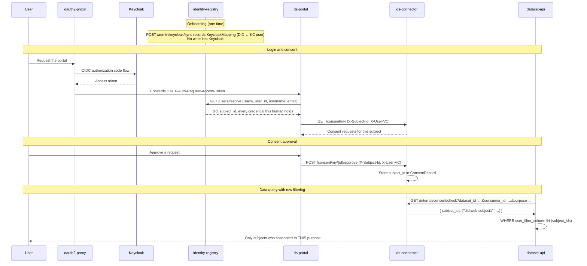

# Subject Identity in the Consent System

How subject identity flows from authentication through consent management to
row-level data filtering.

---

## Subject identity chain

The consent system uses DIDs as the canonical subject identity. It flows through
five stages:

| Stage | Component | What happens |
|-------|-----------|-------------|
| 1. Authentication | oauth2-proxy → Keycloak | The human signs in; the proxy forwards the access token as `X-Auth-Request-Access-Token` |
| 2. Identity resolution | Portal (`hooks.server.ts`) | Calls identity-registry `GET /users/resolve` and caches the answer per session |
| 3. Header propagation | Portal → ds-connector | Sends `X-Subject-Id` plus the credential the call needs as `X-User-VC` |
| 4. Consent storage | ds-connector | Stores the DID in `ConsentRecord.subject_id` |
| 5. Row filtering | dataset-api → ds-connector | Calls `GET /internal/consent/check`, gets consented subject ids, filters rows |

### The DID is resolved, not carried in a claim

**There is no `dataspace_did` claim.** A user attribute of that name was pushed
into Keycloak for a while and *nothing ever read it* — no protocol mapper emitted
it, no service looked it up. It was also the only part of
`POST /admin/keycloak/sync` that required **write** access to the realm, which a
deployment where ds is a guest in somebody else's IdP cannot grant. The push was
deleted; the `KeycloakMapping` row it accompanied is the real join and lives in
ds's own database.

So the portal asks the registry, once per session, from the **verified** token:

```
access token (verified)  ──►  GET /users/resolve?realm&user_id&username&email
                                       │
                                       ▼
                         { did, subject_id, roles[], jws_by_role{} }
```

`resolve` returns **every** credential the human can present, not one — a person
is legitimately both a data subject about their own consumption and a consumer
user acting for an organisation, so the caller selects the credential the
operation requires rather than taking whichever was issued last.

### How `resolve` decides who you are — the cascade

Three identifiers, three different jobs, and only one of them means "the same
human":

| Identifier | Role | Mutable? |
|---|---|---|
| `(realm, user_id)` | **continuity key** | no, within a realm |
| `username` | **data-plane join** — external registries resolve members by it | yes → refreshed, never an identity |
| `email` | **bootstrap seed only** — what a first-time subject id is derived from | yes → never a lookup key once a mapping exists |

Resolution walks `(realm, user_id)` → `(realm, username)` → `(realm, email)` and
**derives a subject id only when all three miss**. Deriving on an *email* miss is
what used to happen, and it was a consent-integrity bug rather than a nuisance: an
address change minted a second DID for the same human, while the data plane still
joined both to one username — so a revocation against one DID did not stop
disclosure authorised under the other.

The cascade reconciles **toward** the id, but only on *absence*:

| Match | Stronger identifier on the record | Action |
|---|---|---|
| id matches | — | authoritative; update username and email freely |
| username matches, no id recorded | — | bind the id; nothing is overwritten |
| username matches, **a different** id recorded | 🔴 | **409, quarantine.** Never rebind, never mint |
| nothing matches | — | first-time user: derive and mint |

The quarantine is the point: "the account was deleted and re-created" and "the
username was recycled to a different person" are indistinguishable from ds's side,
and guessing wrong hands one person's DID, credentials and consent history to
somebody else.

### Why DIDs

- **Stability** — `preferred_username` is a display name a user can change.
- **Canonical identity** — the DID is the dataspace identifier for subjects and
  participants alike.
- **Cross-participant consistency** — the same DID identifies a subject at every
  participant.
- **Realm independence** — the subject id derives as `HMAC(email, encryption key)`,
  so an identity can be minted before the person has ever logged in, and in a
  deployment where ds cannot write to the IdP at all.

> The DID keeps the hash of whatever address seeded it, forever. That is fine —
> it is opaque and does not describe the person — but it is worth knowing before
> somebody notices `did:web:users.x:<hash-of-an-old-address>` and tries to "fix" it.

---

## End-to-end flow



`X-User-VC` is not decoration: `/consent/my/*`, `/consent/status` and `/consumer/*`
authenticate on the credential, verified against the trust anchor, **not** on
`require_permission`. A person's consent authority is a credential, not a group —
which is why an operator with every Keycloak grant in the realm still cannot answer
a consent question on somebody's behalf.

---

## An unbound subject looks like a subject who consented to nothing

`POST /users/identities` resolves a DID to the `username` the data plane joins on,
and **silently omits** anyone with no Keycloak mapping. That omission is correct —
the endpoint must not become a directory of who exists — but it means a subject who
has been provisioned and has never logged in produces *fewer rows*, with no error
anywhere.

So: fewer rows than expected is a binding question before it is a consent question.

---

## Configuration

Nothing to configure on this path. The portal derives every field from the verified
token and the registry; there is no override, and the `DEMO_SUBJECT_ID` escape
hatch that once existed is gone along with the `/demo` route.

---

## Related

- [Consent & Data Sovereignty](consent-and-sovereignty.md) — consent lifecycle and enforcement
- [Identity & DCP](identity-and-dcp.md) — how a DID is minted and resolved
- [`services/connector/README.md`](https://github.com/spindoxlabs/ds/blob/main/services/connector/README.md) — the consent API endpoints
- [`services/portal/README.md`](https://github.com/spindoxlabs/ds/blob/main/services/portal/README.md) — session construction and route guards
