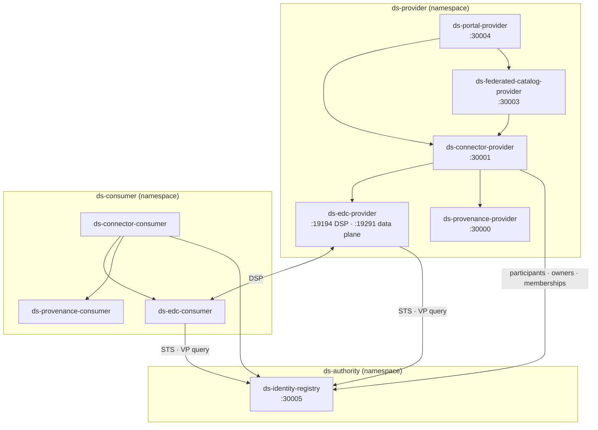

# Deployment

Kubernetes deployment of the platform, via Helm charts composed with
[helmfile](https://helmfile.readthedocs.io/). The charts live in
[`helm/`](https://github.com/spindoxlabs/ds/tree/main/helm); this section is
their reference documentation.

The dev stack (`task start`, Docker Compose) is zero-config by design: every
service ships working defaults so nothing needs an `.env` file. These charts are
the boundary where that stops being true. Their first responsibility is not to
deploy the platform — it is to **make an insecure deployment impossible to
produce by omission**.

!!! warning "Status"
    All charts render end-to-end and the security contract below is enforced by
    the templates. Remaining gaps before a deployment is production-ready are
    tracked in the checklist in
    [`helm/AGENTS.md`](https://github.com/spindoxlabs/ds/blob/main/helm/AGENTS.md)
    — principally log shipping, lockfile-pinned images, and CI gates.

## Where to start

| If you are… | Read |
|-------------|------|
| provisioning the cluster | [Prerequisites](prerequisites.md), then [Keycloak](keycloak.md) |
| configuring a deployment | [Configuration reference](configuration.md), [Secrets](secrets.md) |
| reviewing the security posture | [Exposure and network policy](exposure.md) |
| installing, upgrading, debugging | [Operations](operations.md) |

## What deploys

| Chart | Source | Image | Group |
|-------|--------|-------|-------|
| `ds-common` | — (library chart) | — | shared helpers only |
| `ds-namespaces` | — | — | labeled namespaces |
| `ds-identity-registry` | `services/identity-registry` | `ds-identity-registry` | authority — **once per dataspace** |
| `ds-edc` | `services/edc-connector` | `ds-edc-connector` | participant |
| `ds-connector` | `services/connector` | `ds-connector` | participant |
| `ds-provenance` | `services/provenance` | `ds-provenance` | participant |
| `ds-federated-catalog` | `services/federated-catalog` | `ds-federated-catalog` | participant (optional) |
| `ds-portal` | `services/portal` | `ds-portal` | participant (optional) |

Images are `ghcr.io/spindoxlabs/<name>`, composed from `global.image.registry`,
`global.image.prefix` and the chart's `appVersion`.

### What is deliberately not deployed

| Component | Why |
|-----------|-----|
| PostgreSQL | Externally managed with **CloudNativePG**. Backup, PITR, failover and major-version upgrades belong to an operator, not to an application release. |
| Keycloak | **Externally managed.** The charts consume its issuer and clients; they never mutate the realm unless `global.keycloak.sync.enabled` is set. |
| cert-manager, ingress controller | Cluster-wide singletons owned by the platform. |
| `caddy` | Dev-only reverse proxy. Its did:web rewrite and API fan-in are replaced by native Ingress rules — see [Exposure](exposure.md). |
| `dataset-api-mock` | Dev fixture. The real dataset API is **participant-operated and external**; the charts only carry its URL and shared secret. |
| `dataset-api-fiware-adapter` | No `Dockerfile`, no port — not a deployable unit. |
| `edc-extensions` | Java library, already shaded into the `ds-edc-connector` fat JAR. |

## Topology

One dataspace authority, any number of participants. Each is a separate
namespace and therefore a separate trust boundary.



Namespaces are created and **labeled** by the `ds-namespaces` release. The labels
are load-bearing, not cosmetic:

| Label | On | Used by |
|-------|----|---------|
| `dataspace.spindoxlabs.io/role: authority` | authority ns | operator convention |
| `dataspace.spindoxlabs.io/participant: "true"` | each participant ns | the NetworkPolicy that lets peer EDCs reach the DSP port |
| `pod-security.kubernetes.io/enforce: restricted` | every ns | Pod Security Admission — a pod violating the hardened `securityContext` is rejected by the API server, not merely left unscheduled |

## Release composition

`helmfile.yaml.gotmpl` derives every release from `values.yaml`. Release **names**
follow `ds-<service>-<participant>` — this is load-bearing too: each release name
contains its chart name, so a Service's fullname collapses to the release name
and a chart can address a sibling from `.Values.participant.name` alone, without
guessing at `.Release.Name`.

Ordering is expressed with helmfile `needs`:

```
ds-namespaces
  └── ds-identity-registry                        (authority)
        ├── ds-edc-<p>
        │     └── ds-connector-<p>  ←── ds-provenance-<p>
        │           ├── ds-federated-catalog-<p>  (optional)
        │           └── ds-portal-<p>             (optional)
        └── … one group per participant
```

## The security contract in one page

These are invariants of the charts, not options:

- **`DS_ENV=production` is hardcoded** on every container by `ds.env.common`. It
  is not a value and cannot be turned off. It flips every Python service's
  `ProductionGuard` from warn-only to fail-closed, so a service that inherited a
  dev default refuses to start instead of quietly running with it.
- **`DS_DEMO_IDENTITY_ENABLED` appears nowhere in the charts.** The EDC extension
  it enables accepts self-issued DCP tokens *without verifying their signature* —
  a complete DSP authentication bypass. An absent key cannot be set to `true`.
- **Templates use `required`.** The charts never invent a secret value: a missing
  one fails the render, naming the key, instead of deploying a default nobody
  chose.
- **Pods run as non-root uid 10001**, `allowPrivilegeEscalation: false`, all
  capabilities dropped, read-only root filesystem with an `emptyDir` at `/tmp`,
  seccomp `RuntimeDefault`, and `automountServiceAccountToken: false` — none of
  these services call the Kubernetes API.
- **Default-deny NetworkPolicies** on ingress *and* egress, with explicit allows
  only. See [Exposure](exposure.md).
- **The public surface is three host shapes, path-allowlisted.** EDC management
  and control APIs are never routed publicly.
- **did:web resolves over HTTPS on 443.** The dev stack's plaintext `:80` Caddy
  rewrite does not carry over — DID documents carry the public keys every trust
  decision rests on.

The full contract, including the reasoning and the production-readiness
checklist, is in
[`helm/AGENTS.md`](https://github.com/spindoxlabs/ds/blob/main/helm/AGENTS.md).

## Install, in short

```bash
cd helm

# 1. Prerequisites: CNPG Cluster, Keycloak realm, cert-manager issuer, ingress
#    → see Prerequisites

# 2. Configure
$EDITOR values.yaml                    # baseDomain, postgres, keycloak, participants
cp secrets.example.yaml secrets.sops.yaml
$EDITOR secrets.sops.yaml              # fill every CHANGE_ME

# 3. Encrypt (set your age/KMS recipient in .sops.yaml first)
sops --encrypt --in-place secrets.sops.yaml

# 4. Deploy
export SOPS_AGE_KEY_FILE=~/.config/sops/age/keys.txt
helmfile -e production diff
helmfile -e production apply
```

Each step is expanded in [Operations](operations.md).
