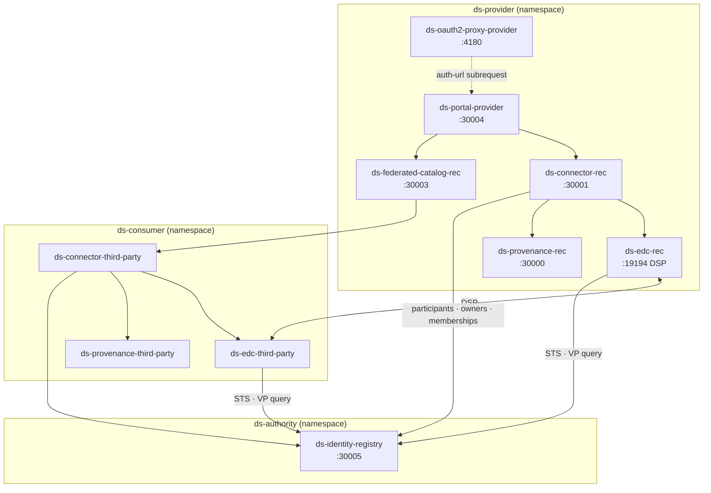

# Deployment

Kubernetes deployment via Helm charts composed with
[helmfile](https://helmfile.readthedocs.io/). The charts live in
[`helm/`](https://github.com/spindoxlabs/ds/tree/main/helm); this section is their operator
documentation.

The development stack is zero-config by design — every service ships working defaults so
`task start` needs no `.env`. **These charts are the boundary where that stops being safe.**
Their first responsibility is not to deploy the platform; it is to make an insecure deployment
impossible to produce by omission.

## Where to start

| If you are… | Read |
|---|---|
| provisioning the cluster | [Prerequisites](prerequisites.md), then [Keycloak requirements](keycloak.md) |
| configuring a deployment | [Configuration reference](configuration.md), [Secrets](secrets.md) |
| reviewing the security posture | [Exposure and network policy](exposure.md) |
| installing, upgrading, debugging | [Operations](operations.md) |

## What deploys

| Chart | Source | Group |
|---|---|---|
| `ds-common` | *(library chart — helpers only)* | shared |
| `ds-namespaces` | — | labelled namespaces |
| `ds-identity-registry` | `services/identity-registry` | authority — **once per dataspace** |
| `ds-edc` | `services/edc-connector` | participant |
| `ds-connector` | `services/connector` | participant |
| `ds-provenance` | `services/provenance` | participant |
| `ds-federated-catalog` | `services/federated-catalog` | participant (optional) |
| `ds-oauth2-proxy` | upstream image | participant — **mandatory wherever the portal runs** |
| `ds-portal` | `services/portal` | participant (optional) |

`ds-oauth2-proxy` is the one release that is upstream software rather than a ds service, and it
is **not optional beside the portal**: the portal is not an OIDC client, so without it the
human-facing host has no authentication in front of it at all.

### What is deliberately not deployed

| Component | Why |
|---|---|
| PostgreSQL | Externally managed with **CloudNativePG**. Backup, PITR, failover and major-version upgrades belong to an operator, not an application release |
| Keycloak | **Externally managed.** The charts consume its issuer and clients, and mutate the realm only when explicitly told to |
| cert-manager, ingress controller | Cluster-wide singletons owned by the platform |
| `caddy` | Dev-only reverse proxy. Its DID rewrite and API fan-in become native Ingress rules — see [Exposure](exposure.md) |
| `dataset-api-mock` | Dev fixture. The real dataset API is **participant-operated and external**; the charts carry its URL and nothing else |
| `dataset-api-fiware-adapter` | A plugin loaded through entry points, not a deployable unit |
| `edc-extensions` | A Java library, already shaded into the EDC image |

## Topology

One dataspace authority, any number of participants. Each is a separate namespace and therefore
a separate trust boundary.


```mermaid
graph TB
  subgraph auth["ds-authority (namespace)"]
    IR["ds-identity-registry<br/>:30005"]
  end

  subgraph p1["ds-provider (namespace)"]
    EDC1["ds-edc-rec<br/>:19194 DSP"]
    CON1["ds-connector-rec<br/>:30001"]
    PROV1["ds-provenance-rec<br/>:30000"]
    FC1["ds-federated-catalog-rec<br/>:30003"]
    O2P1["ds-oauth2-proxy-provider<br/>:4180"]
    PORT1["ds-portal-provider<br/>:30004"]
  end

  subgraph p2["ds-consumer (namespace)"]
    EDC2["ds-edc-third-party"]
    CON2["ds-connector-third-party"]
    PROV2["ds-provenance-third-party"]
  end

  EDC1 <-->|DSP| EDC2
  CON1 --> EDC1
  CON1 --> PROV1
  CON2 --> EDC2
  CON2 --> PROV2
  PORT1 --> CON1
  PORT1 --> FC1
  O2P1 -.->|auth-url subrequest| PORT1
  FC1 --> CON2
  EDC1 -->|STS · VP query| IR
  EDC2 -->|STS · VP query| IR
  CON1 -->|participants · owners · memberships| IR
  CON2 --> IR
```

Namespaces are created **and labelled** by the `ds-namespaces` release. The labels are
load-bearing, not cosmetic:

| Label | On | Used by |
|---|---|---|
| `dataspace.spindoxlabs.io/role: authority` | the authority namespace | operator convention |
| `dataspace.spindoxlabs.io/participant: "true"` | each participant namespace | the NetworkPolicy that lets peer EDCs reach the DSP port |
| `pod-security.kubernetes.io/enforce: restricted` | every namespace | Pod Security Admission — a pod violating the hardened `securityContext` is rejected by the API server, not merely left unscheduled |

A participant namespace created by hand without the participant label cannot reach anyone
else's DSP endpoint.

## Release composition

`helmfile.yaml.gotmpl` derives every release from `values.yaml`. Release **names** follow
`ds-<service>-<participant>`, and that is load-bearing: each name contains its chart name, so a
Service's fullname collapses to the release name and a chart can address a sibling from the
participant name alone.

Ordering is expressed with helmfile `needs`:

```
ds-namespaces
  └── ds-identity-registry                        (authority)
        └── per participant:
              ds-edc-<p>
              ds-provenance-<p>
              ds-connector-<p>      needs edc + provenance + registry
                ├── ds-federated-catalog-<p>      (optional)
                ├── ds-oauth2-proxy-<p>           (with the portal)
                └── ds-portal-<p>   needs connector + oauth2-proxy
```

The portal's dependency on oauth2-proxy is deliberate: the portal's Ingress points `auth-url` at
that Service, and **an Ingress whose auth backend does not resolve fails closed** — every
request 500s. Ordering makes that a deploy-time wait instead of an outage.

## The security contract in one page

Invariants of the charts, not options:

- **`DS_ENV=production` is hardcoded** on every container. It is not a value and cannot be
  turned off. It flips every Python service's startup guard from warn-only to fail-closed, so a
  service that inherited a dev default refuses to start.
- **`DS_DEMO_IDENTITY_ENABLED` appears nowhere in the charts.** The EDC extension it enables
  accepts self-issued DCP tokens *without verifying their signature* — a complete DSP
  authentication bypass. An absent key cannot be set to `true`.
- **Templates use `required`.** The charts never invent a secret value: a missing one fails the
  render and names the key, instead of deploying a default nobody chose.
- **Pods run as non-root uid 10001**, `allowPrivilegeEscalation: false`, all capabilities
  dropped, read-only root filesystem with an `emptyDir` at `/tmp`, seccomp `RuntimeDefault`,
  `automountServiceAccountToken: false`.
- **Default-deny NetworkPolicies** on ingress *and* egress, with explicit allows only.
- **The public surface is four host shapes, path-allowlisted.** EDC management and control APIs
  are never routed publicly, and are denied twice — at routing and at the network layer.
- **`did:web` resolves over HTTPS on 443.** The dev stack's plaintext `:80` Caddy rewrite does
  not carry over: DID documents carry the public keys every trust decision rests on.

## Install, in short

```bash
cd helm

# 1. Prerequisites: a CNPG Cluster, a Keycloak realm, a cert-manager issuer, an ingress
#    controller  → see Prerequisites

# 2. Configure
$EDITOR values.yaml                    # baseDomain, postgres, keycloak, participants
cp secrets.example.yaml secrets.sops.yaml
$EDITOR secrets.sops.yaml              # fill every CHANGE_ME
$EDITOR .sops.yaml                     # set your age or KMS recipient

# 3. Encrypt
sops --encrypt --in-place secrets.sops.yaml

# 4. Deploy
export SOPS_AGE_KEY_FILE=~/.config/sops/age/keys.txt
helmfile -e production diff
helmfile -e production apply
```

Each step is expanded in [Operations](operations.md).
