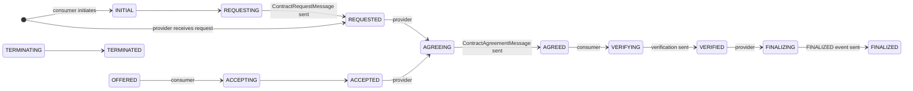

# EDC 0.18.0 — control plane

What the control plane stores, the two state machines it runs, and how the Dataspace
Protocol reaches them. Paths are relative to the `Connector` repository at `v0.18.0`;
`.../` elides the Java package path. DSP specification paths are in the
`eclipse-edc/DataspaceProtocol` repository at tag `2025-1-err1` (read with
`git show 2025-1-err1:<path>`).

## The provider's three definitions

| Entity | Class | Holds |
|---|---|---|
| Asset | `spi/control-plane/asset-spi/.../asset/spi/domain/Asset.java` | `properties`, `privateProperties`, `dataAddress` (how the data plane reaches the data), `dataplaneMetadata` |
| Policy definition | `spi/control-plane/policy-spi/.../policy/spi/PolicyDefinition.java` | an ODRL `Policy` plus `privateProperties` |
| Contract definition | `spi/control-plane/contract-spi/.../types/offer/ContractDefinition.java` | `accessPolicyId`, `contractPolicyId`, `assetsSelector` (a list of `Criterion`), `privateProperties` |

`Asset` and `PolicyDefinition` extend `AbstractParticipantResource`
(`spi/common/connector-participant-context-spi/.../types/AbstractParticipantResource.java`) —
every resource carries a `participantContextId`
(see [Participant context](participant-context.md)).

A contract definition joins them: *for assets matching `assetsSelector`, show them to whoever
passes `accessPolicyId`, and offer them under `contractPolicyId`.* Nothing else creates an
offer.

### Access policy versus contract policy

| | Access policy | Contract policy |
|---|---|---|
| Question | may this participant **see** the offer? | may this participant **sign** it? |
| Scope | `catalog` | `contract.negotiation` |
| Evaluated in catalogue | `ContractDefinitionResolverImpl.resolveFor` (`core/control-plane/control-plane-catalog/...`) — a failing definition is simply omitted | — (it becomes the offer's policy) |
| Evaluated in negotiation | again, in `ContractValidationServiceImpl.validateInitialOffer` | `validateInitialOffer`, after targeting the policy at the asset |
| Ends up in the agreement | no | yes |

`ContractValidationServiceImpl`
(`core/control-plane/control-plane-contract/.../validation/`) checks, in order: access
policy, asset exists, asset matches the definition's selector, contract policy. Scopes and
evaluation are detailed in [Policy engine](policy-engine.md).

## Catalogue

A DSP `CatalogRequestMessage` is served by `CatalogProtocolServiceImpl`
(`core/control-plane/control-plane-aggregate-services/.../services/catalog/`): it verifies the
token (`request.catalog` scope), asks `DatasetResolverImpl` for datasets and the
`DataServiceRegistry` for data services, and builds a `Catalog`.

`DatasetResolverImpl.toDataset` (`core/control-plane/control-plane-catalog/...`) turns each
(definition, asset) pair into an offer: the contract policy with type `OFFER`, under an id
from `ContractOfferId.create(definitionId, assetId)`
(`spi/control-plane/contract-spi/.../ContractOfferId.java`) — `definition:asset:uuid`, each
part Base64-encoded. `ContractOfferId.parseId` is how the provider later recovers the
definition from an offer id.

The outgoing side (a consumer asking another connector) is `CatalogServiceImpl` in the same
package. A **catalog crawler** — the federated catalogue — ships in the same repository in
0.18.0: `core/catalog-crawler/catalog-crawler-core/` (`CatalogCrawlerManager`,
`DspCatalogRequestAction`, `PagingCatalogFetcher`, `QueryServiceImpl`), SPIs in
`spi/crawler-spi` and `spi/federated-catalog-spi`, API in
`extensions/federated-catalog/api/federated-catalog-api`. `controlplane-base-bom` includes
both the crawler core and the API.

## Contract negotiation

States (`spi/control-plane/contract-spi/.../types/negotiation/ContractNegotiationStates.java`):

`INITIAL(50)`, `REQUESTING(100)`, `REQUESTED(200)`, `OFFERING(300)`, `OFFERED(400)`,
`ACCEPTING(700)`, `ACCEPTED(800)`, `AGREEING(825)`, `AGREED(850)`, `VERIFYING(1050)`,
`VERIFIED(1100)`, `FINALIZING(1150)`, `FINALIZED(1200)`, `TERMINATING(1300)`,
`TERMINATED(1400)`. Final: `FINALIZED`, `TERMINATED`.

The spec defines only the "-ED" states (`specifications/negotiation/contract.negotiation.protocol.md`,
*States* and *State Machine*). The "-ING" states are EDC's: they mark work the local state
machine still has to do. Decision record `2025-01-28-async-protocol-message-processing`: a
protocol service only validates and records the transition, and a manager does the work
asynchronously.

Each `ContractNegotiation` has `type` `CONSUMER` or `PROVIDER`.

What each local processing step does
(`core/control-plane/control-plane-contract/.../negotiation/NegotiationProcessorsImpl.java`):

| State processed | Side | Action | Next |
|---|---|---|---|
| `INITIAL` | consumer | — | `REQUESTING` |
| `REQUESTING` | consumer | send `ContractRequestMessage` | `REQUESTED` |
| `ACCEPTING` | consumer | send `ACCEPTED` event | `ACCEPTED` |
| `AGREED` | consumer | — | `VERIFYING` |
| `VERIFYING` | consumer | send `ContractAgreementVerificationMessage` | `VERIFIED` |
| `OFFERING` | provider | send `ContractOfferMessage` | `OFFERED` |
| `REQUESTED`, `ACCEPTED` | provider | — | `AGREEING` |
| `AGREEING` | provider | build agreement, send `ContractAgreementMessage` | `AGREED` |
| `VERIFIED` | provider | — | `FINALIZING` |
| `FINALIZING` | provider | send `FINALIZED` event | `FINALIZED` |
| `TERMINATING` | both | send `ContractNegotiationTerminationMessage` | `TERMINATED` |

A transient send failure keeps the state and retries (`RetryProcessor`,
`core/common/lib/state-machine-lib/.../retry/processor/`, DR
`2025-02-05-state-machine-retry-processor-refactor`); a final failure moves to `TERMINATING`.

**The provider agrees automatically.** `REQUESTED` goes straight to `AGREEING` once the
initial offer validated. The only built-in way to hold a negotiation for an external decision
is a **pending guard** (DR `2023-07-20-state-machine-guards`):
`ContractNegotiationPendingGuard` (`spi/control-plane/contract-spi/.../negotiation/`), a
`Predicate<ContractNegotiation>`; when it returns true the manager sets the entity `pending`
and stops processing it until something clears the flag. The default guard is `it -> false`.

Incoming messages map to transitions in `ContractNegotiationProtocolServiceImpl`
(`core/control-plane/control-plane-aggregate-services/.../contractnegotiation/`):
`notifyRequested` (validates the initial offer), `notifyOffered`, `notifyAccepted`,
`notifyAgreed` (consumer: `validateConfirmed`), `notifyVerified`, `notifyFinalized`,
`notifyTerminated`.

### Two execution models

| Module | Model | BOM |
|---|---|---|
| `core/control-plane/control-plane-contract-manager` | **polling state machine**: `ConsumerContractNegotiationManagerImpl` / `ProviderContractNegotiationManagerImpl` lease batches from the store by state | `controlplane-base-bom` |
| `core/control-plane/control-plane-contract-task-executor` | **task-based**: `ContractNegotiationStateListener` turns state events into `Task`s; `ContractNegotiationTaskExecutorImpl` runs them (skipping pending, final or unexpected entities) | `controlplane-virtual-base-bom` |

Both call the same `NegotiationProcessors`. The task SPI is `spi/common/task-spi`, its
in-memory core `core/common/task-core`; tasks can travel over NATS
(`extensions/control-plane/tasks/nats/**`, `controlplane-virtual-feature-nats-bom`). No
decision record in the 0.18.0 tree covers the task model — not verified beyond the code.

### The agreement

`spi/control-plane/contract-spi/.../types/agreement/ContractAgreement.java`: `id` (local),
`agreementId` (shared on the wire, DR `2025-10-03-contract-agreement-changes`), `providerId`,
`consumerId`, `contractSigningDate` (epoch seconds), `assetId`, `policy`,
`participantContextId`, `claims`. Assigner and assignee live on the **policy**, set by the
provider in `processAgreeing`; see [Policy engine](policy-engine.md#agreements-assigner-assignee-equality).

## Transfer process

States (`spi/control-plane/transfer-spi/.../types/TransferProcessStates.java`):

`INITIAL(100)`, `PREPARATION_REQUESTED(250)`, `REQUESTING(400)`, `REQUESTED(500)`,
`STARTING(550)`, `STARTUP_REQUESTED(570)`, `STARTED(600)`, `SUSPENDING(650)`,
`SUSPENDING_REQUESTED(675)`, `SUSPENDED(700)`, `RESUMING(720)`, `RESUMING_REQUESTED(722)`,
`RESUMED(725)`, `COMPLETING(750)`, `COMPLETING_REQUESTED(775)`, `COMPLETED(800)`,
`TERMINATING(825)`, `TERMINATING_REQUESTED(840)`, `TERMINATED(850)`.
Deprecated since 0.16.0: `PROVISIONING(200)`, `PROVISIONED(300)`, `DEPROVISIONING(900)`,
`DEPROVISIONING_REQUESTED(950)`, `DEPROVISIONED(1000)` — provisioning moved into the data
plane (DR `2025-02-27-move-provisioning-phase-data-plane`). Final: `COMPLETED`, `TERMINATED`,
`DEPROVISIONED`.

Spec: `specifications/transfer/transfer.process.protocol.md` (*States*, *State Machine*,
push and pull sections).

Processing (`core/control-plane/control-plane-transfer/.../processors/TransferProcessorsImpl.java`,
driven by `TransferProcessManagerImpl` in `control-plane-transfer-manager`):

| State | Side | Action |
|---|---|---|
| `INITIAL` | consumer | find the agreement policy (`PolicyArchive`), `DataFlowController.prepare` → `PREPARATION_REQUESTED` if async, else `REQUESTING` |
| `REQUESTING` | consumer | send `TransferRequestMessage` → `REQUESTED` |
| `STARTUP_REQUESTED` | consumer | set after a `TransferStartMessage` arrives; `DataFlowController.started` → `STARTED` |
| `INITIAL` | provider | `DataFlowController.start` → `STARTUP_REQUESTED` if async, else `STARTING`; keeps any returned `DataAddress` |
| `STARTING` | provider | send `TransferStartMessage` carrying the data address (read from the `DataAddressStore`) → `STARTED`, and notify listeners (`started`) |
| `SUSPENDING`, `RESUMING`, `COMPLETING`, `TERMINATING` (and `*_REQUESTED`) | both | call the data-flow controller, then send the matching DSP message |

On the provider, an incoming `TransferRequestMessage` is handled by
`TransferProcessProtocolServiceImpl.requestedAction`: it checks the transfer type is one the
asset supports (`DataFlowController.transferTypesFor`), then
`ContractValidationServiceImpl.validateAgreement` (identity equals the agreement's consumer;
`transfer.process` scope), then creates the provider process.

### Transfer type, push and pull

DR `2023-11-20-transfer-type` separated the **transfer type** from the destination
`DataAddress` type. `TransferTypeParserImpl`
(`core/control-plane/control-plane-transfer/.../flow/`) parses
`<DESTTYPE>-<PUSH|PULL>[-<RESPONSETYPE>]`, e.g. `HttpData-PULL`; `FlowType` is `PUSH` or
`PULL` (`spi/common/core-spi/.../types/domain/transfer/`). The transfer type selects the data
plane. In **pull**, the provider returns an endpoint and a token in the `TransferStartMessage`
data address (an EDR); in **push**, the provider's data plane sends to the consumer's
destination. See [Data plane](data-plane.md).

### The data-flow controller

`DataFlowController` (`spi/control-plane/transfer-spi/.../flow/DataFlowController.java`) —
`prepare`, `start`, `suspend`, `resume`, `terminate`, `started`, `completed`,
`transferTypesFor` — is the single hook between transfer process and data plane (DR
`2026-01-08-inline-data-flow-manager` removed the older `DataFlowManager`). Two
implementations exist in 0.18.0, each from a plain `@Provider`:

- `DataPlaneSignalingFlowController` —
  `data-protocols/data-plane-signaling/data-plane-signaling-core/...`
- `LegacyDataPlaneSignalingFlowController` —
  `extensions/control-plane/transfer/transfer-data-plane-signaling/...`, whose extension is
  `@Deprecated(since = "0.16.0")`.

With both on the classpath the later registration replaces the earlier with a warning; which
one that is depends on extension order — not verified.

### Policy monitor

Provider transfers in `STARTED` are re-evaluated periodically in the `policy.monitor` scope and
terminated on failure. See [Policy engine](policy-engine.md#the-policy-monitor).

## The DSP layer

### Version

EDC 0.18.0 implements **DSP 2025-1 only**
(`data-protocols/dsp/dsp-2025/dsp-spi-2025/.../type/Dsp2025Constants.java`):

| Constant | Value |
|---|---|
| `V_2025_1_VERSION` / `V_2025_1_PATH` | `2025-1` / `/2025-1` |
| `DATASPACE_PROTOCOL_HTTP_V_2025_1` | `dataspace-protocol-http:2025-1` |
| `DATASPACE_HTTP_PROFILE_2025_1` | `http-dsp-profile-2025-1` |

Namespace `https://w3id.org/dspace/2025/1/`. There are no 0.8 or 2024-1 constants in the
tree. The protocol string format `<name>:<version>` comes from DR
`2024-09-25-multiple-protocol-versions`.

`GET /.well-known/dspace-version` is served by `DspVersionApiController`
(`data-protocols/dsp/dsp-version/dsp-version-http-api/`), as required by
`specifications/common/common.protocol.md` (*Exposure of Versions*). The protocol context's
default path is `/api/protocol`; the callback address advertised to counterparties is
`edc.dsp.callback.address`
(`data-protocols/dsp/dsp-core/dsp-http-api-base-configuration/.../DspApiBaseConfigurationExtension.java`).

### Endpoints

All under `/<protocol path>/2025-1`. Controllers: `DspCatalogApiController20251`,
`DspNegotiationApiController20251`, `DspTransferProcessApiController20251`
(`data-protocols/dsp/dsp-2025/**`), extending base controllers in `data-protocols/dsp/dsp-lib/**`.

| Endpoint | Handler |
|---|---|
| `POST /catalog/request`, `GET /catalog/datasets/{id}` | `CatalogProtocolService` |
| `GET /negotiations/{id}` | state query |
| `POST /negotiations/request`, `POST /negotiations/{id}/request` | `notifyRequested` |
| `POST /negotiations/offers`, `POST /negotiations/{id}/offers` | `notifyOffered` |
| `POST /negotiations/{id}/events` | `notifyAccepted` / `notifyFinalized` |
| `POST /negotiations/{id}/agreement` | `notifyAgreed` |
| `POST /negotiations/{id}/agreement/verification` | `notifyVerified` |
| `POST /negotiations/{id}/termination` | `notifyTerminated` |
| `GET /transfers/{id}`, `POST /transfers/request` | state query / new provider transfer |
| `POST /transfers/{id}/start` · `/completion` · `/suspension` · `/termination` | `TransferProcessProtocolService` |

Spec path tables: `specifications/catalog/catalog.binding.https.md`,
`specifications/negotiation/contract.negotiation.binding.https.md`,
`specifications/transfer/transfer.process.binding.https.md`.

The virtual control plane mounts the same controllers under
`/{participantContextId}/{profileId}/...` (`data-protocols/dsp/dsp-virtual/**`), with
`/{participantContextId}/.well-known/dspace-version`.

### Inbound: token first, then state

Every protocol service call goes through `ProtocolTokenValidatorImpl`
(`core/control-plane/control-plane-aggregate-services/.../protocol/`, DR
`2023-11-27-refactor-protocol-services`): evaluate the `request.*` scope to collect required
credential scopes, `IdentityService.verifyJwtToken`, extract the participant id for the
profile, build the `ParticipantAgent`. Only then does the service touch state.

### Outbound: dispatch

`ProtocolRemoteMessageDispatcher`
(`spi/control-plane/control-plane-spi/.../services/spi/protocol/`) —
`dispatch(participantContextId, responseType, message)` — has one implementation,
`DspHttpRemoteMessageDispatcherImpl`
(`data-protocols/dsp/dsp-core/dsp-http-core/.../dispatcher/`). It holds the `IdentityService`
and a `TokenDecorator`, evaluates the matching `request.*` scope to parameterise the token,
and sends the message serialised for the profile's version. DR `2026-06-10-remove-dispatcher-registry` removed the older
`RemoteMessageDispatcherRegistry`; it does not exist in 0.18.0.

### Profiles and webhooks

DR `2025-05-28-dataspace-profile-context`: a `DataspaceProfileContext`
(`spi/common/protocol-spi/.../DataspaceProfileContext.java`) is a record of `name`,
`protocolVersion`, `webhook`, `idExtractionFunction`, `protocolNamespace`,
`jsonLdContextsUrl`, kept in `DataspaceProfileContextRegistry`
(`core/control-plane/control-plane-core/.../profile/`). The callback URL a message carries
comes from `ProtocolWebhookResolver.getWebhook(participantContextId, protocol)`
(`spi/common/protocol-spi`); DR `2025-01-21-multiple-protocol-webhooks` proposed a
`ProtocolWebhookRegistry`, which is not the 0.18.0 shape.

## Aggregate services

The Management API and extensions should go through the services in
`core/control-plane/control-plane-aggregate-services/.../services/`, not the stores:
`AssetServiceImpl`, `PolicyDefinitionServiceImpl`, `ContractDefinitionServiceImpl`,
`ContractAgreementServiceImpl`, `ContractNegotiationServiceImpl`
(`initiateNegotiation(ParticipantContext, ContractRequest)`, `terminate`, `delete`),
`TransferProcessServiceImpl` (`initiateTransfer`, `suspend`, `resume`, `complete`,
`terminate`, `notifyPrepared`, `notifyStarted`), `CatalogServiceImpl`, `SecretServiceImpl`.
They validate, run in a transaction and emit events.

## What ds adds on top

`services/edc-extensions` registers a `ContractNegotiationPendingGuard` that parks a provider
negotiation in `REQUESTED` while a data subject decides, and a Management API route,
`POST /dataspaces/negotiations/{id}/resume`, that clears the flag. ds runs the classic
polling managers and excludes the `data-protocols/data-plane-signaling` modules, so only
the legacy `DataFlowController` is present. See [edc-extensions](../../services/edc-extensions.md).
