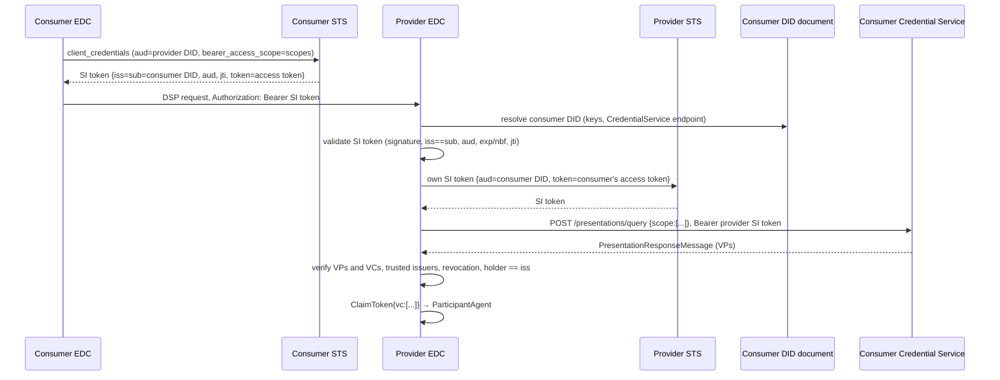

# EDC 0.18.0 — identity and trust

How a connector proves who it is to another connector, and how the other side decides what
to believe. Paths are relative to the named repository at `v0.18.0` (`Connector`,
`IdentityHub`). DCP specification paths are in `eclipse-edc/decentralized-claims-protocol`
at tag `v1.0.1` (read with `git show v1.0.1:<path>`); `DC/` abbreviates
`Connector: extensions/common/iam/decentralized-claims`.

## The one SPI: `IdentityService`

`Connector: spi/common/core-spi/src/main/java/org/eclipse/edc/spi/iam/IdentityService.java`
(`@ExtensionPoint`):

```java
Result<TokenRepresentation> obtainClientCredentials(String participantContextId, TokenParameters parameters);
Result<ClaimToken> verifyJwtToken(String participantContextId, TokenRepresentation tokenRepresentation, VerificationContext context);
```

Both take a participant context id. `TokenParameters` carries header and claim maps;
`ClaimToken` the verified claims; `VerificationContext` a `Policy`, a set of required
`scopes`, and typed extra data (same package).

There are two callers, one per direction:

| Direction | Caller | What it does with the result |
|---|---|---|
| outbound | `DspHttpRemoteMessageDispatcherImpl` (`Connector: data-protocols/dsp/dsp-core/dsp-http-core/.../dispatcher/`) | puts the token in the `Authorization` header of the DSP request |
| inbound | `ProtocolTokenValidatorImpl` (`Connector: core/control-plane/control-plane-aggregate-services/.../protocol/`) | turns the `ClaimToken` into a `ParticipantAgent` |

Implementations in 0.18.0:

- `DcpIdentityService` — `DC/decentralized-claims-service/.../service/DcpIdentityService.java`,
  provided by `DcpCoreExtension`. This is what `controlplane-dcp-bom` installs.
- `MockIdentityService` — `Connector: extensions/common/iam/iam-mock/`. The "token" is a JSON
  `{clientId}` with no signature; the participant id is read from `client_id`. For tests only.

The DSP specification does not define authentication; DCP says it "fills this gap"
(`specifications/dataspace.ecosystem.md`).

## DCP version

EDC 0.18.0 implements **DCP v1.0**: `DSPACE_DCP_NAMESPACE_V_1_0 = "https://w3id.org/dspace-dcp/v1.0/"`
(`Connector: spi/common/decentralized-claims-spi/.../DcpConstants.java`). IdentityHub keeps a
`V_0_8` constant deprecated since 0.12.0 and maps only the v1.0 namespace on its presentation
endpoint (`IdentityHub: protocols/dcp/dcp-identityhub/presentation-api/.../PresentationApiController.java`).

## The DCP flow



### Consumer side: getting a token

`DcpIdentityService.obtainClientCredentials`:

1. requires a `scope` claim matching `(.+):(.+):(read|write|\*)` — a null or blank scope is a
   failure, so **a DCP request with no computed scopes cannot be sent**. The regex is applied
   to the whole space-joined string;
2. sets `iss` = `sub` = own DID, `aud` from the parameters;
3. calls `SecureTokenService.createToken(participantContextId, claims, scope)` and prefixes
   `Bearer `.

In step 2, other `TokenParameters` claims are copied with `HashMap.replace` into an empty map,
which does nothing — only `iss`, `sub` and `aud` reach the STS. The default audience is the
counterparty id (`DcpDefaultServicesExtension.defaultAudienceResolver`).

The own DID is resolved by `DC/decentralized-claims-core/.../DidConfigProvider.java` from
`edc.participant.id`, then `edc.participant.did`, then `edc.iam.issuer.id` (deprecated since
0.17.0, logs a warning).

### STS: remote only, in the Connector

`SecureTokenService` (`Connector: spi/common/decentralized-claims-spi/.../SecureTokenService.java`)
has **one implementation in the Connector repository**, `RemoteSecureTokenService`
(`DC/decentralized-claims-sts/lib/decentralized-claims-sts-remote-lib/`). It does an OAuth2
`client_credentials` request, forwarding `audience`, `token` and `bearer_access_scope`.
Settings (`DC/decentralized-claims-sts/decentralized-claims-sts-remote-client/.../StsRemoteClientExtension.java`),
read per participant context through `ParticipantContextConfig`:

| Setting | Meaning |
|---|---|
| `edc.iam.sts.oauth.token.url` | STS token endpoint |
| `edc.iam.sts.oauth.client.id` | client id (IdentityHub uses the DID) |
| `edc.iam.sts.oauth.client.secret.alias` | vault alias of the client secret |

The embedded STS, `EmbeddedSecureTokenService`, lives in **IdentityHub**
(`IdentityHub: extensions/sts/sts-core/.../EmbeddedSecureTokenService.java`), served at
`POST /token` on the `sts` context (default port 9292, path `/api/sts`). IdentityHub decision
record `2025-02-24-sts-deployment-embedded`: the STS "must always be embedded in the
IdentityHub runtime". It issues:

- the SI token: `iss` = `sub` = DID, `aud`, `iat`, `nbf`, `exp` (default 5 min,
  `edc.iam.sts.token.expiration`), `jti` (random UUID), signed with the participant's active
  `sign_token` key, `kid` header;
- when `bearer_access_scope` is given, an access token in the `token` claim: `iss` = holder
  DID, `aud` = holder DID, `sub` = verifier DID, `scope`, `jti`.

### Provider side: verifying

`DcpIdentityService.verifyJwtToken`:

1. strip `Bearer `;
2. validate the SI token (`DC/decentralized-claims-core/.../validation/SelfIssueIdTokenValidationAction.java`):
   key from the DID document by `kid`, `aud` equals own DID, and the `dcp-si` rules registered
   in `DcpCoreExtension` — `IssuerEqualsSubjectRule`, `SubJwkIsNullRule`, `TokenNotNullRule`,
   expiry / issued-at, not-before, and `JtiValidationRule` when
   `edc.iam.accesstoken.jti.validation` is true (default). The JTI rule rejects a reused `jti`
   but **passes a token without one** (`Connector: core/common/lib/token-lib/.../rules/JtiValidationRule.java`);
3. request a presentation through `PresentationRequestService`
   (`Connector: spi/common/decentralized-claims-spi/.../PresentationRequestService.java`, DR
   `2025-11-10-presentation-request-service`; default
   `DC/lib/decentralized-claims-lib/.../DefaultPresentationRequestService.java`, a default
   provider so it can be replaced): mint an own SI token carrying the consumer's access token,
   find the `CredentialService` entry in the consumer's DID document
   (`DidCredentialServiceUrlResolver`), and `POST {endpoint}/presentations/query` with a
   `PresentationQueryMessage` holding the scopes (`DefaultCredentialServiceClient`);
4. check every requested scope is covered by a returned credential type, validate the VCs,
   and check each VP holder equals the SI token `iss`;
5. return a `ClaimToken` with a single claim, `vc`, the list of verified credentials
   (`DcpDefaultServicesExtension`, replaceable via `ClaimTokenCreatorFunction`).

The DCP spec requires the signing key to be referenced from `capabilityInvocation`
(`specifications/base.protocol.md`); the string does not occur in Connector or IdentityHub
main code — not checked by 0.18.0 as far as a search shows.

### Credential verification

- VP formats: `MultiFormatPresentationVerifier` over `JwtPresentationVerifier`,
  `Vcdm20JosePresentationVerifier` (`Connector: extensions/common/crypto/jwt-verifiable-credentials/`)
  and `LdpVerifier` (`Connector: extensions/common/crypto/ldp-verifiable-credentials/`), with
  `JsonWebSignature2020` from `jws2020-lib`.
- Per credential (`DC/lib/verifiable-credentials-lib/.../VerifiableCredentialValidationServiceImpl.java`):
  `IsInValidityPeriod`, `IsNotRevoked`, `HasValidIssuer`, `HasValidSubjectSchema`,
  `HasValidSubjectIds`.
- **Trusted issuers** (`DC/decentralized-claims-issuers-configuration/.../TrustedIssuerConfigurationExtension.java`):
  `edc.iam.trustedissuer.<alias>.id`, `.supportedtypes` (JSON list, default `["*"]`),
  `.properties`. The older `edc.iam.trusted-issuer.<alias>.*` prefix is deprecated since 0.17.0
  and still read. An issuer not configured fails `HasValidIssuer`.
- **Revocation** (`Connector: extensions/common/iam/verifiable-credentials/.../RevocationServiceRegistryExtension.java`):
  `StatusList2021Entry` and `BitstringStatusListEntry`. Cache
  `edc.iam.credential.revocation.cache.validity` (15 min). **A credential status of an unknown
  type logs a warning and passes** (`RevocationServiceRegistryImpl`).

## Scopes

Which credentials the provider asks for is computed by policy validators on the three
`request.*` contexts ([Policy engine](policy-engine.md#every-scope-in-0180)), on both sides:
the consumer puts the result in the SI token request, the provider passes it as
`VerificationContext.scopes`.

- `DcpScopeExtractorExtension` registers `DcpScopeExtractorFunction` as a **pre-validator**,
  which walks the policy and asks each registered `ScopeExtractor`
  (`Connector: spi/common/decentralized-claims-spi/.../scope/ScopeExtractor.java`) for scopes.
- `DynamicDcpScopeExtension` (DR `2026-01-30-dynamic-dcp-scopes`) registers
  `DefaultScopeMappingFunction` as a **post-validator** that adds every configured `DEFAULT`
  scope, and a `DynamicScopeExtractor` that adds a `POLICY` scope when a constraint's left
  operand starts with a configured prefix. Settings
  (`DynamicDcpScopeConfigurationExtension`), under `edc.iam.dcp.scopes.<key>.`: `id`, `type`
  (`DEFAULT` | `POLICY`), `value`, `prefix.mapping` (`prefix-mapping` deprecated since 0.17.0),
  `profile` (default `*`). Scopes are stored in a `DcpScopeStore` (in-memory by default).

Scope grammar — the three sources differ:

| Source | Form |
|---|---|
| DCP spec (`specifications/verifiable.presentation.protocol.md`) | `[alias]:[discriminator]`, aliases `org.eclipse.dspace.dcp.vc.type`, `org.eclipse.dspace.dcp.vc.id` |
| Connector `DcpIdentityService` | must match `(.+):(.+):(read|write|\*)` |
| IdentityHub `EdcScopeToCriterionTransformer` (`IdentityHub: core/common-core/.../defaults/`) | alias must be `org.eclipse.dspace.dcp.vc.type`, operation `read`, `*` or `all`; becomes "credential type contains discriminator". Its javadoc says not to use it in production |

The DR's example alias `org.eclipse.edc.vc.type` would not pass IdentityHub's default
transformer — inferred from the code, not run.

## From claims to `ParticipantAgent`

`ProtocolTokenValidatorImpl` applies the profile's `ParticipantIdExtractionFunction`. For DCP
it is `DefaultDcpParticipantIdExtractionFunction`: the first non-null `credentialSubject.id`
among the verified credentials — **not** the SI token's `iss`. A null id is a `401`. The agent
gets all `ClaimToken` claims (i.e. `vc`) plus attributes from registered
`ParticipantAgentServiceExtension`s; DCP adds an optional `DcpParticipantAgentServiceExtension`
hook. The local side's own id comes from `ParticipantIdentityResolver`, which returns the
participant context's identity (`ParticipantContextIdentityResolverImpl`,
`Connector: core/common/participant-context-connector-core/.../identity/`).

## IdentityHub

A separate EDC runtime (`IdentityHub` repository, same version) that holds a participant's
keys, DIDs and credentials. Launchers: `identityhub`, `identityhub-oauth2`, `issuer-service`,
`issuer-service-oauth2`. BOMs: `identityhub-base-bom`, `identityhub-bom` (adds API
authentication/authorisation and the embedded STS), `identityhub-oauth2-bom`,
`identityhub-feature-sql-bom`, and the `issuerservice-*` equivalents.

| Role | Endpoint (default context) | Source |
|---|---|---|
| Credential Service — presentation | `POST /v1/participants/{participantContextId}/presentations/query` (`credentials`, 13131, `/api/credentials`) | `protocols/dcp/dcp-identityhub/presentation-api` |
| Credential Service — storage | `POST /v1/participants/{participantContextId}/credentials` | `protocols/dcp/dcp-identityhub/storage-api` |
| STS | `POST /token` (`sts`, 9292, `/api/sts`) | `extensions/sts/sts-api` |
| DID publishing (`did:web`) | `did` context, 10100, `/` | `extensions/did/local-did-publisher` |
| Identity API (management) | `/v1beta/participants/...`, keypairs, dids, credentials (`identity`, 15151, `/api/identity`) | `extensions/api/identity-api/*` |
| Issuer Service | separate launcher; DCP issuance API `v1beta`, issuer admin API | `core/issuerservice/*`, `protocols/dcp/dcp-issuer/*` |

Presentation queries are checked by `SelfIssuedTokenVerifierImpl`
(`IdentityHub: core/identity-hub-core/.../verification/`): the SI token's `aud` is the
participant's DID, the nested access token is verified with the participant's own key, its
`sub` equals the SI token's `sub`, and its `scope` bounds what may be returned.

Per participant context (`IdentityHubParticipantContext`,
`IdentityHub: spi/participant-context-spi/.../model/`): a DID, key pairs with usages
`sign_credentials` / `sign_presentation` / `sign_token`, an STS account (client id = DID,
secret in the vault under `<participantContextId>-sts-client-secret` by default), an API key,
and scopes. The Identity API authenticates with `x-api-key` and authorises with the scopes
`identity-api:read`, `identity-api:write`, `identity-api:admin` (admin bypasses the ownership
check, `IdentityApiScopes.java`); new participant contexts are created by a super-user
(`IdentityHub: docs/developer/architecture/identity-api.security.md`).

## What the protocol secures, and what it does not

From DCP v1.0 (`specifications/base.protocol.md` unless noted):

| Secured | Spec text |
|---|---|
| audience binding | "The `aud` MUST be set to the Verifier DID." |
| replay | "The `jti` claim MUST be used to mitigate against replay attacks." |
| self-issued identity | "The `iss` and `sub` claims MUST be equal and set to the bearer's (participant's) DID." |
| holder binding of the access token | the access token "MUST be contained in the `token` claim of a Self-Issued ID Token" (`verifiable.presentation.protocol.md`) |

| Not covered | Spec text |
|---|---|
| people | "presentation protocols that rely on end-user (i.e., human) consent are not applicable" (`trust.model.md`) |
| the STS | "an internal system and therefore out of scope" (`trust.model.md`) |
| how the trusted-issuer list is provided | "out of scope of the current specification" (`trust.model.md`) |
| transport | interactions are expected "to be secure and use Transport Level Security" (`trust.model.md`) |
| scope ↔ credential mapping | "out of the scope of this specification" (`verifiable.presentation.protocol.md`) |
| data-plane traffic | not mentioned by the DCP spec; the pull token is EDC's own ([Data plane](data-plane.md)) |

What a provider learns is *which participant* (a DID backed by credentials from an issuer it
trusts) is calling. Anything about a person, a purpose or consent has to be carried by policy
and decided elsewhere.

## What ds adds on top

ds's EDC uses the remote STS client and `did:web` resolution against its own identity
registry rather than IdentityHub; the settings it uses are listed in
[edc-connector](../../services/edc-connector.md#the-settings-that-matter).
