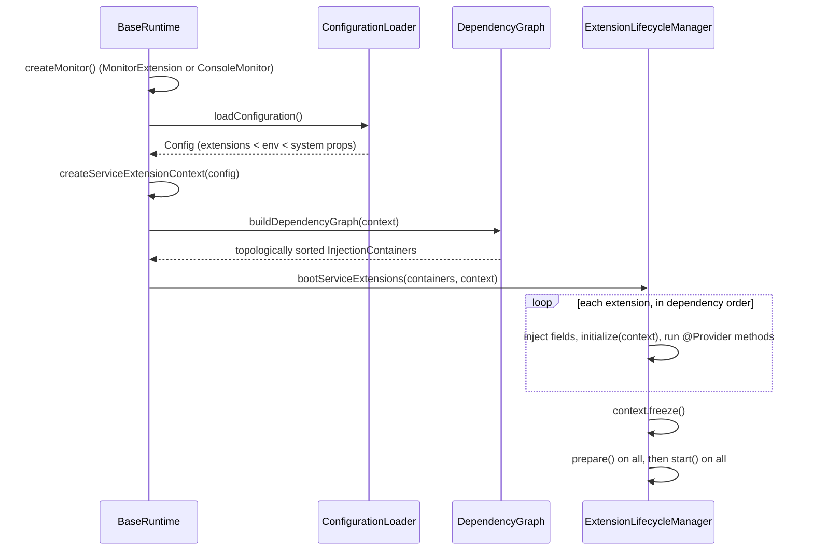

# EDC 0.18.0 — the runtime model

How an EDC process is put together: what a runtime is, how extensions are found, wired
and started, and how configuration reaches them. Everything on this page is read from the
EDC `v0.18.0` sources; paths are relative to the root of the named repository
(`Connector`, `Runtime-Metamodel`, `IdentityHub`).

The other pages in this version:

| Page | Covers |
|---|---|
| [Control plane](control-plane.md) | assets, policies, contract definitions, catalog, negotiation and transfer state machines, the DSP layer |
| [Policy engine](policy-engine.md) | the ODRL model, scopes, `PolicyContext`, functions and validators, `ParticipantAgent` |
| [Identity and trust](identity-and-trust.md) | `IdentityService`, DCP, STS, presentations, trusted issuers, IdentityHub |
| [Management API](management-api.md) | the API versions in 0.18.0 and every authentication and authorisation option |
| [Participant context](participant-context.md) | multi-tenancy: one runtime, several participants |
| [Data plane](data-plane.md) | data-plane framework, selection, signalling, EDRs and pull tokens |
| [Events and extensibility](events-and-extensibility.md) | events, callbacks, state-machine hooks, extension points, stores |

## A runtime is a set of extensions

EDC has no fixed application. A runtime is a JVM whose classpath holds a set of modules;
each module contributes one or more `ServiceExtension` classes, listed in the module's
`META-INF/services/org.eclipse.edc.spi.system.ServiceExtension` file and discovered with the
JDK `ServiceLoader`.

- `Connector: core/common/boot/src/main/java/org/eclipse/edc/boot/system/ServiceLocatorImpl.java`
  — `ServiceLoader.load(type)`.
- `Connector: core/common/boot/src/main/java/org/eclipse/edc/boot/system/ExtensionLoader.java`
  — `buildDependencyGraph` loads every `ServiceExtension`; `loadMonitor` loads
  `MonitorExtension`s and falls back to a `ConsoleMonitor`.

A "control plane", a "data plane" or an "identity hub" is therefore just a choice of
modules. The entry point is always the same class:
`Connector: core/common/boot/src/main/java/org/eclipse/edc/boot/system/runtime/BaseRuntime.java`
(`main` → `boot(true)`).

## Boot sequence

Sources: `BaseRuntime.boot`, and
`Connector: core/common/boot/src/main/java/org/eclipse/edc/boot/system/injection/lifecycle/ExtensionLifecycleManager.java`.

If any required injection point cannot be satisfied, `boot` logs
`"<type> is required by extension <name>"` for each and throws
`"Problems occurred during dependency injection"` — the runtime does not start half-wired.

### The extension lifecycle

`Connector: spi/common/boot-spi/src/main/java/org/eclipse/edc/spi/system/ServiceExtension.java`
defines five hooks, all with empty defaults:

| Hook | When | Rule |
|---|---|---|
| `initialize(context)` | after this extension's fields are injected, in dependency order | register services here |
| `prepare()` | after **every** extension has initialised and the context is frozen | do **not** register services (the javadoc says so; the frozen context throws) |
| `start()` | after every `prepare()` | begin serving / start state machines |
| `shutdown()` | JVM shutdown hook, **reverse** boot order | |
| `cleanup()` | after all `shutdown()`s, reverse order | release what `shutdown` still needed (DB connections) |

`context.freeze()` makes the service registry read-only:
`DefaultServiceExtensionContext.registerService` throws
`"Cannot register service …, the ServiceExtensionContext is in read-only mode"` after it
(`Connector: core/common/boot/src/main/java/org/eclipse/edc/boot/system/DefaultServiceExtensionContext.java`).
Registering a second instance of a type before the freeze **replaces** the first, with a
warning.

`edc.runtime.id` is no longer honoured: the context always assigns a random UUID "to
guarantee a working lease mechanism", and warns if the key is set (same file). `edc.component.id`
is the stable identifier across replicas
(`Connector: core/common/boot/src/main/java/org/eclipse/edc/boot/BootServicesExtension.java`).

## Dependency injection

The annotations live in a separate repository,
`Runtime-Metamodel: runtime-metamodel/src/main/java/org/eclipse/edc/runtime/metamodel/annotation/`
(version `0.18.0` per `Runtime-Metamodel: gradle.properties`).

| Annotation | Target | Meaning |
|---|---|---|
| `@Inject(required = true)` | field | a service from the context; `required = false` leaves it `null` if nobody provides it |
| `@Provider(isDefault = false)` | method | the return value is registered as a service; `isDefault = true` makes it a fallback |
| `@Setting(key, defaultValue, required, min, max, description, warnOnMissingConfig)` | field | a configuration value (see below) |
| `@Settings` | type | marks a class as a settings holder |
| `@Configuration` | field | a whole configuration object (record or POJO) built from settings |
| `@Extension(value, categories)` | type | human name of the extension |
| `@Provides(...)` / `@Requires(...)` | type | declare provided / required service types without a field or method |
| `@ExtensionPoint` | type | marks an SPI interface meant for extension |
| `@SettingContext` | type, field | **deprecated since 0.18.0** |

### How providers are ordered and chosen

`Connector: core/common/boot/src/main/java/org/eclipse/edc/boot/system/DependencyGraph.java`:

- Every non-default `@Provider` return type and every `@Provides` type is recorded as a
  *feature* of its extension. Every `@Inject` field and `@Requires` type is a *dependency*.
  A topological sort puts providers before dependants; a cycle throws
  `CyclicDependencyException`.
- `@Provider(isDefault = true)` methods are **not** run eagerly. They are attached to the
  matching injection points as a fallback.
- At injection time, `ServiceInjectionPoint.resolve` uses the registered service if the
  context has one, and only otherwise asks the default supplier
  (`Connector: core/common/boot/src/main/java/org/eclipse/edc/boot/system/injection/ServiceInjectionPoint.java`,
  `.../InjectionPointDefaultServiceSupplier.java`). A required point with neither fails boot.

This is the mechanism behind "add a module to replace an in-memory default". Examples of
defaults in the core:

| Default | Provided by |
|---|---|
| `Vault` (in-memory), `ExecutorInstrumentation` | `Connector: core/common/boot/src/main/java/org/eclipse/edc/boot/BootServicesExtension.java` |
| `TransactionContext` (no-op), `DataSourceRegistry` | `Connector: core/common/runtime-core/src/main/java/org/eclipse/edc/runtime/core/RuntimeDefaultCoreServicesExtension.java` |
| `ControlClientAuthenticationProvider`, `ParticipantIdMapper` | `Connector: core/common/connector-core/src/main/java/org/eclipse/edc/connector/core/CoreDefaultServicesExtension.java` |
| `PrivateKeyResolver`, `KeyParserRegistry` | `Connector: core/common/connector-core/src/main/java/org/eclipse/edc/connector/core/SecurityDefaultServicesExtension.java` |

Non-default core services every runtime gets — `EventRouter`, `TypeTransformerRegistry`,
`JsonObjectValidatorRegistry`, `CriterionOperatorRegistry`, `ApiVersionService`,
`EdcHttpClient` (`RuntimeCoreServicesExtension`); `PolicyEngine`, `RuleBindingRegistry`,
`ParticipantAgentService`, `DataAddressValidatorRegistry` (`CoreServicesExtension`, same
package as above); `Clock`, `Telemetry`, `HealthCheckService` (`BootServicesExtension`).

### Configuration injection

Decision record `Connector: docs/developer/decision-records/2024-11-06-configuration-injection/`
introduced `@Setting` on instance fields as an injection point:

- `String`, `Integer`, `Long`, `Double`, `Boolean` fields are converted from the config value;
  a missing required value is an injection failure, so it is reported with the others at boot.
- `defaultValue` makes `required` irrelevant; `required = false` leaves the field `null`.
- `@Configuration` fields are built by
  `Connector: core/common/boot/src/main/java/org/eclipse/edc/boot/system/injection/ConfigurationObjectFactory.java`
  — records through their canonical constructor, other classes through a default constructor.

A `@Setting` on a `static final String` constant (the older style, still common) only
documents the key; the extension then reads it with `context.getSetting(...)` or
`context.getConfig(...)`.

## Configuration sources

`Connector: core/common/boot/src/main/java/org/eclipse/edc/boot/config/ConfigurationLoader.java`
merges, in increasing precedence:

1. every `ConfigurationExtension` found by `ServiceLoader`, merged together;
2. environment variables;
3. JVM system properties.

Environment keys are mapped by lower-casing and replacing `_` with `.`
(`Connector: spi/common/boot-spi/src/main/java/org/eclipse/edc/spi/system/configuration/ConfigFactory.java`,
`fromEnvironment`). `EDC_PARTICIPANT_ID` becomes `edc.participant.id`. Keys that themselves
contain `_` cannot be set from the environment.

The one packaged `ConfigurationExtension` is `configuration-filesystem`:
`Connector: extensions/common/configuration/configuration-filesystem/src/main/java/org/eclipse/edc/configuration/filesystem/FsConfigurationExtension.java`
reads the properties file named by `edc.fs.config` (default
`dataspaceconnector-configuration.properties`).

A `Config` is hierarchical: `context.getConfig("web.http")` returns the partition under that
prefix (`Connector: spi/common/boot-spi/src/main/java/org/eclipse/edc/spi/system/SettingResolver.java`).
This is how "one block per API context" settings such as `web.http.<context>.port` are read.

## Distributions: the BOMs

EDC 0.18.0 publishes its supported module sets as BOMs under `Connector: dist/bom/`. A BOM is a
Gradle module with only `api(...)` dependencies.

| BOM | What it is |
|---|---|
| `controlplane-base-bom` | the "classic" control plane: core, contract and transfer managers, DSP, data-plane selector, policy monitor, catalog crawler, Management API (`management-api`), control API, `auth-tokenbased`, `auth-delegated`, callbacks, EDR store receiver, federated-catalog API, the classic single-participant context (`participant-context-connector-classic-core`) |
| `controlplane-feature-dcp-bom` | DCP identity: `decentralized-claims-core`, `-service`, `-transform`, `-issuers-configuration`, the **remote** STS client, VC verification (JWT and LDP), DID core |
| `controlplane-dcp-bom` | `controlplane-base-bom` + `controlplane-feature-dcp-bom` |
| `controlplane-feature-sql-bom` | SQL stores for every control-plane store, JTI validation, data-plane instances, policy monitor, federated catalog; SQL pool, lease, bootstrapper, local transactions |
| `dataplane-base-bom` | data-plane core, HTTP source/sink, HTTP OAuth2, data-plane signalling API, self-registration, `data-plane-iam`, the control-API client |
| `dataplane-feature-sql-bom` | SQL stores for data flows and access-token data |
| `controlplane-virtual-base-bom` | the **multi-participant** control plane: task-based executors, `dsp-virtual`, `management-api-v5`, `management-api-authorization`, `management-api-oauth2-authentication`, `aes-encryption`, CEL — see [Participant context](participant-context.md) |
| `controlplane-virtual-feature-dcp-bom`, `-sql-bom`, `-nats-bom` | the DCP, SQL and NATS features for the virtual control plane |
| `federatedcatalog-base-bom`, `-dcp-bom`, `-feature-sql-bom` | a federated-catalog runtime |

Two consequences worth stating:

- **The classic and virtual control planes are different module sets**, not a switch. The
  classic BOM ships `management-api`; the virtual BOM ships `management-api-v5` and the
  scope-based authorisation modules. See [Management API](management-api.md).
- The classic BOM contains **no SQL**; persistence is a feature BOM or individual modules.
  Without them every store is in-memory and lost on restart.

## Where to look next

The SPI modules (`Connector: spi/**`) are the contracts; `core/**` holds the default
implementations; `extensions/**` holds optional technology bindings; `data-protocols/**`
holds the DSP and data-plane-signalling wire protocols. Decision records under
`Connector: docs/developer/decision-records/` explain most non-obvious choices and are cited
per page.

## What ds adds on top

`services/edc-connector/build.gradle.kts` assembles `controlplane-dcp-bom` (with the three
`data-plane-signaling*` protocol modules excluded and `transfer-data-plane-signaling` added
back), `dataplane-base-bom`, `configuration-filesystem`, `identity-did-web`, individual SQL
store modules and `transaction-local`, plus the repository's own extensions. It uses the
classic, single-participant control plane. See [edc-connector](../../services/edc-connector.md)
and [edc-extensions](../../services/edc-extensions.md).
