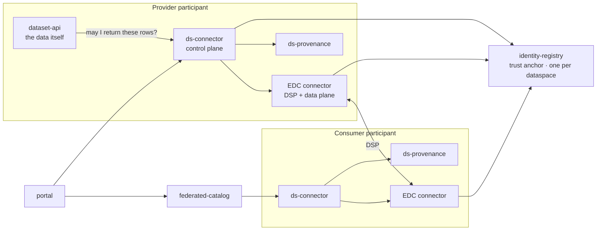

# Dataspaces

**ds** is a data-space platform: a set of services that let independent organisations
publish data to each other under machine-readable contracts, and let the people the data
describes decide what may be shared about them.

It implements the [DSSC Blueprint](blueprints/dssc/index.md) reference architecture and
specialises it for energy communities through [CEEDS](blueprints/ceeds/index.md). The
exchange it runs end to end is the *consumer-pull* flow: a consumer discovers an offering
in a catalogue, negotiates an ODRL contract with the provider, receives an Endpoint Data
Reference, and pulls the data — with consent checked at negotiation time, again while the
transfer runs, and once more per query, before any row leaves the provider.

It is a **platform, not a deployment**. Everything domain-specific lives in extension
points: the ODRL profile, governance overlays, Keycloak client overlays.

## The shape of it

Two roles of the same software. A **participant** runs a connector, an EDC runtime and a
provenance store; the **authority** runs one identity registry for the whole dataspace.

## Where to go

| If you want to… | Read |
|---|---|
| understand a component | [Services](services/connector.md) — one page per service and shared library |
| run the stack locally | [Development](development/running-the-stack.md) |
| deploy to Kubernetes | [Deployment](deployment/index.md) |
| know what the dataspace has decided | [Rulebook](rulebook/index.md) |
| know what a dataspace must implement | [Blueprints](blueprints/index.md) |
| check the purpose taxonomy | [Taxonomies](taxonomies/dpv-2.3.md) |

## The five ideas worth knowing first

**Governance is a file, not code.** A provider declares its datasets in `governance.yaml`
— access level, classification, purposes, row filters, retention. `ds-connector` compiles
that into ODRL policies and pushes them into the EDC. Changing what may be shared is an
edit and a sync, not a release.

**Policy decisions are taken in Python, asked in Java.** The EDC evaluates ODRL constraints
during negotiation and for the lifetime of a transfer, but every constraint function calls
back into `ds-connector`'s `/internal/*` API for the answer. There is one decision point.

**A data subject is a first-class party.** People hold Verifiable Credentials issued by the
trust anchor and use them directly against the consent API — no operator in between. A
withdrawn consent terminates running transfers, because the EDC re-evaluates the agreement's
policy while data is flowing.

**Identity is `did:web` plus verifiable credentials.** Participants are DIDs resolved over
HTTPS; authorisation between participants runs on DCP presentations, not shared secrets.
Human and service authorisation inside a participant runs on OIDC through Keycloak — two
mechanisms, deliberately separate.

**Every act is recorded as PROV-O.** Catalogue views, negotiations, transfers, queries,
consent decisions — sixteen event types, materialised into a lineage graph you can traverse.
