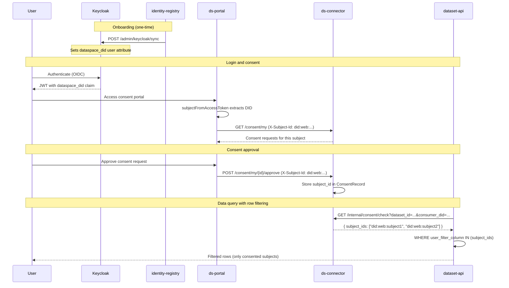

# Subject Identity in the Consent System

How subject identity flows from authentication through consent management to row-level data filtering.

---

## Subject identity chain

The consent system uses DIDs (Decentralized Identifiers) as the canonical subject identity. The identity flows through five stages:

| Stage | Component | What happens |
|-------|-----------|-------------|
| 1. Authentication | Keycloak | User authenticates via OIDC; JWT includes `dataspace_did` claim (set by the dataspace scope) |
| 2. Token parsing | Portal (`subjectFromAccessToken`) | Extracts subject ID from JWT using priority chain (see below) |
| 3. Header propagation | Portal -> ds-connector | Portal passes subject ID via `X-Subject-Id` header on consent API calls |
| 4. Consent storage | ds-connector | Stores subject ID in `ConsentRecord.subject_id` |
| 5. Row filtering | dataset-api -> ds-connector | Calls `GET /internal/consent/check`, gets consented subject IDs, filters rows |

### Subject ID priority chain

`subjectFromAccessToken` in `src/routes/demo/+page.server.ts` resolves the subject ID using the first available value:

```
DEMO_SUBJECT_ID env var
  -> dataspace_did JWT claim
    -> preferred_username JWT claim
      -> sub JWT claim
        -> fallback
```

This chain is backward compatible -- if `dataspace_did` is not present in the JWT (e.g. before identity-registry sync), the existing `preferred_username` or `sub` claims are used.

---

## Why DIDs for subject identity

- **Stability**: Keycloak `preferred_username` is a display name that users can change; it is not a stable identifier
- **Canonical identity**: DIDs are the standard dataspace identifier for participants and subjects
- **Cross-participant consistency**: The same DID identifies a subject across all participants in the dataspace
- **Credential binding**: The `dataspace_did` attribute is populated by identity-registry's Keycloak sync (`POST /admin/keycloak/sync`), linking the Keycloak account to the subject's DataSubjectCredential

---

## End-to-end flow



---

## Configuration

| Variable | Component | Purpose |
|----------|-----------|---------|
| `DEMO_SUBJECT_ID` | Portal | Override subject ID for development/testing (highest priority) |
| `dataspace_did` | Keycloak user attribute | Set by identity-registry sync; appears as JWT claim |

---

## Related

- [Consent & Data Sovereignty](../../../docs/consent-and-sovereignty.md) -- consent lifecycle and enforcement
- [ds-connector README](../README.md) -- consent API endpoints
- [ds-portal README](../../portal/README.md) -- authentication and route access
