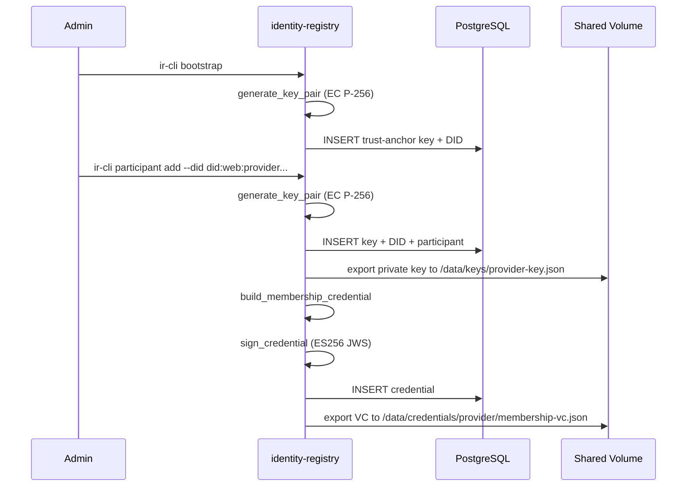
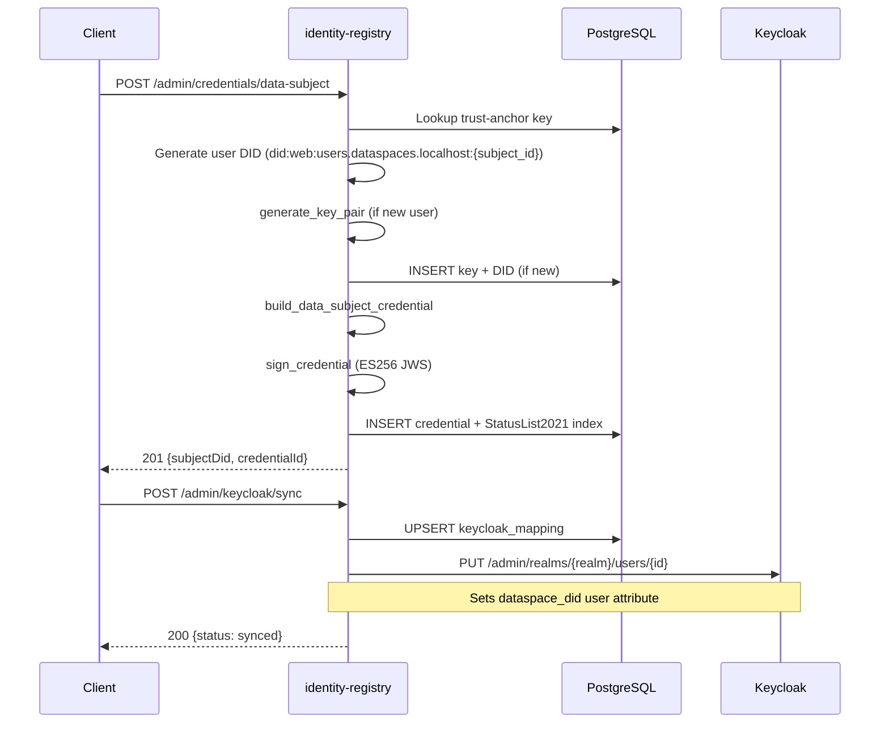

# ds-identity-registry

Manages participant identities, DIDs, Verifiable Credentials, and key material for the dataspace. Replaces static key files and manual VC issuance scripts.

Port: `30005`

---

## Technology

Python 3.12 / FastAPI / SQLAlchemy 2 (async) / PostgreSQL / Alembic / `cryptography` / `pyjwt`

---

## Database

6 tables:

- `keys` — EC P-256 key pairs (JSONB for private_jwk/public_jwk), owner_did, kid, active flag, rotation tracking
- `dids` — DID records with type (participant/user), service_endpoints (JSONB), FK to keys
- `credentials` — VCs (JSONB credential_json), type, issuer/subject DIDs, status (active/revoked), StatusList2021 index
- `participants` — participant registry with DID (FK), role, allowed_scopes (JSONB), dsp_address
- `keycloak_mappings` — DID-to-Keycloak user mappings (realm, user_id, email, subject_id)
- `status_lists` — StatusList2021 bitstrings (LargeBinary), purpose (revocation)

---

## Services layer

### `crypto.py`

EC P-256 key generation (`generate_key_pair`), JWK serialization, ES256 signing (`sign_es256`), JWS creation (`create_jws`), `generate_credential_id` (urn:uuid), `next_key_index` for rotation.

### `did.py`

`build_did_document` — W3C DID document builder. Supports participant and user types. Participant DIDs get an `authentication` array. Includes `assertionMethod`. Optional `service` entries from service_endpoints.

### `vc.py`

`build_membership_credential` + `build_data_subject_credential` builders. `sign_credential` adds `JsonWebSignature2020` proof using ES256 JWS. Includes `credentialStatus` with StatusList2021Entry.

### `status_list.py`

BITSTRING_SIZE = 16384 (16 KB = 131072 slots). Functions: `create_bitstring`, `set_bit`, `get_bit`, `encode_bitstring` (zlib + base64), `decode_bitstring`, `next_available_index`, `build_status_list_credential`.

### `export.py`

`export_private_key(base_path, participant_name, private_jwk)` writes to `{base_path}/keys/{name}-key.json`. `export_credential(base_path, participant_name, filename, credential_json)` writes to `{base_path}/credentials/{name}/{filename}`.

---

## REST API — 3 trust levels

### Public (no auth)

| Method | Path | Purpose |
|--------|------|---------|
| `GET` | `/dids/{did}/did.json` | Resolve DID document (returns `application/did+ld+json`) |
| `GET` | `/status/{list-id}` | StatusList2021 credential (returns `application/ld+json`) |
| `GET` | `/health` | Liveness check |

### Internal (no auth, network-restricted)

| Method | Path | Purpose |
|--------|------|---------|
| `GET` | `/participants` | List all active participants |
| `GET` | `/participants/{did}/check?scope=` | Check if participant is allowed for scope |

### Admin (JWT with `identity-registry.admin` scope)

| Method | Path | Purpose |
|--------|------|---------|
| `POST` | `/admin/participants` | Register participant (auto-creates DID + key + exports) |
| `GET` | `/admin/participants` | List all participants |
| `GET` | `/admin/participants/{did}` | Get participant detail with credentials |
| `PATCH` | `/admin/participants/{did}` | Update participant |
| `DELETE` | `/admin/participants/{did}` | Deactivate participant + revoke credentials |
| `POST` | `/admin/dids` | Create DID with auto-generated key |
| `GET` | `/admin/dids/{did}` | Get DID details |
| `DELETE` | `/admin/dids/{did}` | Deactivate DID + revoke credentials |
| `POST` | `/admin/credentials/membership` | Issue MembershipCredential |
| `POST` | `/admin/credentials/data-subject` | Issue DataSubjectCredential |
| `GET` | `/admin/credentials/{id}` | Get credential JSON |
| `GET` | `/admin/credentials` | List credentials (optional `?subject_did=`) |
| `DELETE` | `/admin/credentials/{id}` | Revoke credential |
| `POST` | `/admin/keycloak/sync` | Sync DID-to-Keycloak mapping |
| `POST` | `/admin/keys/rotate/{did}` | Rotate key for DID |
| `GET` | `/keycloak/mapping/{did}` | Get KC mapping by DID |
| `GET` | `/keycloak/mapping?subject_id=` | Get KC mapping by subject ID |

---

## CLI (ir-cli)

Entry point: `ir-cli = "identity_registry.cli.main:run"`

| Command | Purpose |
|---------|---------|
| `ir-cli bootstrap` | Create trust-anchor DID + key (idempotent) |
| `ir-cli participant add` | Register participant with auto MembershipCredential |
| `ir-cli participant list` | List all participants |
| `ir-cli participant remove` | Deactivate a participant |
| `ir-cli credential issue-membership` | Issue MembershipCredential |
| `ir-cli credential issue-data-subject` | Issue DataSubjectCredential |
| `ir-cli credential revoke` | Revoke a credential |
| `ir-cli credential list` | List all credentials |
| `ir-cli key rotate` | Rotate key for a DID |
| `ir-cli status export` | Export StatusList2021 as JSON |

---

## Configuration

Env prefix: `IDENTITY_REGISTRY_`

| Variable | Default | Purpose |
|----------|---------|---------|
| `IDENTITY_REGISTRY_DATABASE_URL` | `postgresql+asyncpg://...` | PostgreSQL connection string |
| `IDENTITY_REGISTRY_ENCRYPTION_KEY` | `dev-encryption-key-...` | Fernet key for encrypting private keys at rest |
| `IDENTITY_REGISTRY_EXPORT_BASE_PATH` | `/data` | Base path for key/credential export to shared volume |
| `IDENTITY_REGISTRY_OIDC_ISSUER_URL` | `None` | OIDC issuer for JWT verification (admin endpoints) |
| `IDENTITY_REGISTRY_ADMIN_SCOPE` | `identity-registry.admin` | Required JWT scope for admin endpoints |
| `KEYCLOAK_ADMIN_URL` | `None` | Keycloak admin API base URL |
| `KEYCLOAK_CLIENT_ID` | `ds-identity-registry` | Keycloak service account client ID |
| `KEYCLOAK_CLIENT_SECRET` | `insecure-dev-secret` | Keycloak service account secret |
| `IDENTITY_REGISTRY_DEFAULT_CREDENTIAL_TTL_DAYS` | `365` | Default credential validity |
| `IDENTITY_REGISTRY_MAX_CREDENTIAL_TTL_DAYS` | `730` | Maximum credential validity |
| `IDENTITY_REGISTRY_TRUST_ANCHOR_DOMAIN` | `trust-anchor.dataspaces.localhost` | Domain for the trust-anchor DID |
| `IDENTITY_REGISTRY_CREDENTIALS_CONTEXT_URL` | `https://dataspaces.localhost/ns/credentials/v1` | Credentials JSON-LD context URL |
| `IDENTITY_REGISTRY_DATASPACE_URI` | `https://dataspaces.localhost/dataspace` | Dataspace membership URI |

---

## DID document structure

```json
{
  "@context": ["https://www.w3.org/ns/did/v1", "https://w3id.org/security/suites/jws-2020/v1"],
  "id": "did:web:provider.dataspaces.localhost",
  "verificationMethod": [{
    "id": "did:web:provider.dataspaces.localhost#key-1",
    "type": "JsonWebKey2020",
    "controller": "did:web:provider.dataspaces.localhost",
    "publicKeyJwk": { "kty": "EC", "crv": "P-256", "x": "...", "y": "...", "kid": "...", "use": "sig" }
  }],
  "assertionMethod": ["did:web:provider.dataspaces.localhost#key-1"],
  "authentication": ["did:web:provider.dataspaces.localhost#key-1"]
}
```

---

## MembershipCredential structure

```json
{
  "@context": [
    "https://www.w3.org/2018/credentials/v1",
    "https://w3id.org/security/suites/jws-2020/v1",
    "https://dataspaces.localhost/ns/credentials/v1"
  ],
  "id": "urn:uuid:...",
  "type": ["VerifiableCredential", "MembershipCredential"],
  "issuer": "did:web:trust-anchor.dataspaces.localhost",
  "issuanceDate": "2026-07-13T12:00:00Z",
  "expirationDate": "2027-07-13T12:00:00Z",
  "credentialSubject": {
    "id": "did:web:provider.dataspaces.localhost",
    "memberOf": "https://dataspaces.localhost/dataspace",
    "role": "Provider",
    "allowedScopes": ["dataspaces.query"]
  },
  "credentialStatus": {
    "id": "https://trust-anchor.dataspaces.localhost/status/1#0",
    "type": "StatusList2021Entry",
    "statusPurpose": "revocation",
    "statusListIndex": "0",
    "statusListCredential": "https://trust-anchor.dataspaces.localhost/status/1"
  },
  "proof": {
    "type": "JsonWebSignature2020",
    "created": "2026-07-13T12:00:00Z",
    "verificationMethod": "did:web:trust-anchor.dataspaces.localhost#key-1",
    "proofPurpose": "assertionMethod",
    "jws": "..."
  }
}
```

---

## Participant registration flow



---

## Data-subject credential issuance + Keycloak sync



---

## Development

```bash
cd services/identity-registry
uv sync
uv run uvicorn identity_registry.main:create_app --factory --port 30005
uv run alembic upgrade head
uv run pytest
```

---

## Docker

Two-stage Dockerfile (builder + runtime). Port 30005, non-root `app` user. Healthcheck via `/health`.

```bash
# Built as part of the connector stack
docker compose -f services/connector/docker-compose.yml up -d
```

---

## DSSC Blueprint alignment

| Building Block | Implementation |
|---------------|---------------|
| BB01 (Trust Framework) | Trust anchor bootstrapping, MembershipCredential issuance |
| BB02 (Identity & Attestation) | `did:web:` lifecycle, EC P-256 keys, StatusList2021 revocation |
